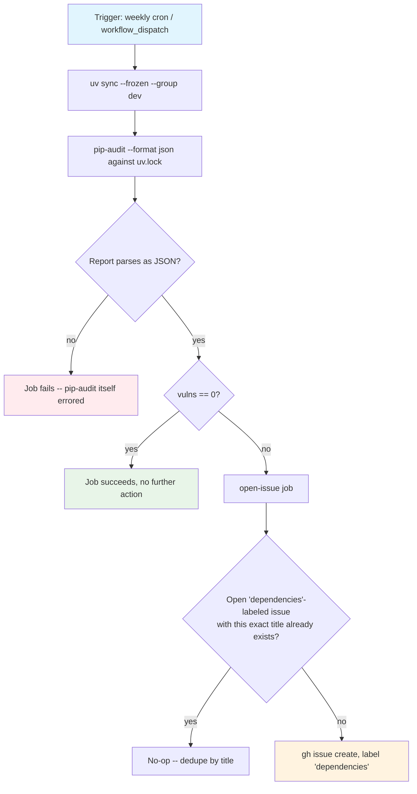

## Workflow Overview

**Purpose**: Catch known vulnerabilities in the fully resolved dependency tree on a fixed weekly
cadence, independent of Dependabot's own per-ecosystem schedule (`spec/spec-process-cicd-dependabot.md`),
and surface a real finding as a tracked, deduped issue rather than a red, one-off CI run. Mirrors the
`audit.yml` workflow already proven in production on the sibling repo `datahub-healthdcat-ap-exporter`
(issue #56, part of the `#48` standardization epic).

**Trigger Events**: `schedule` (`0 6 * * 1` -- Monday 06:00 UTC) and `workflow_dispatch` for on-demand
runs.

**Target Environments**: None. Reads `uv.lock` and, on a finding, opens a GitHub issue; never deploys
anything.

> **Status**: Implemented at `.github/workflows/audit.yml`. This document is the design contract that
> file must satisfy; changes to either should keep the other in sync, per Change Management below.

## Execution Flow Diagram

## Jobs & Dependencies

| Job Name | Purpose | Dependencies | Execution Context |
|----------|---------|--------------|--------------------|
| `audit` | Install the locked dependency tree (`uv sync --frozen --group dev`) and run `pip-audit --format json` against it; parse the report and expose `vulns` (count) and `summary` (one-line-per-finding string) as job outputs. | None | Linux runner |
| `open-issue` | If `audit` reports `vulns != '0'`, open a `dependencies`-labeled issue describing the finding, deduped by exact title against already-open issues. No-ops via `if:` when there is nothing to report. | `audit` | Linux runner |

## Requirements Matrix

### Functional Requirements

| ID | Requirement | Priority | Acceptance Criteria |
|----|-------------|----------|---------------------|
| REQ-001 | The scan runs weekly on a fixed schedule, independent of Dependabot's own cadence. | High | `on.schedule` contains `cron: "0 6 * * 1"`. |
| REQ-002 | The scan can also be run on demand. | High | `on.workflow_dispatch: {}` is present; `gh workflow run audit.yml` succeeds. |
| REQ-003 | The scan audits the committed, locked dependency tree, not whatever the resolver would pick today. | High | The `audit` job installs via `uv sync --frozen ...` (`--frozen` refuses to touch `uv.lock`) before running `pip-audit`, so the report reflects exactly what `uv.lock` pins. |
| REQ-004 | A real vulnerability finding opens (or dedupes into) a `dependencies`-labeled issue; it never gets silently dropped. | High | When `audit`'s `vulns` output is a nonzero string, `open-issue` runs and either creates a new issue titled `pip-audit: known vulnerability in dependencies` with label `dependencies`, or finds an existing open one with that exact title and no-ops. |
| REQ-005 | A real vulnerability finding does not fail the workflow. | High | The `audit` job step only calls `exit 1` when the JSON report itself is unreadable (see REQ-006); a report that parses with `vulns > 0` falls through to `exit 0`. |
| REQ-006 | A `pip-audit` execution failure (not a finding) does fail the workflow. | High | `pip-audit`'s own exit code is captured but not trusted (it returns 1 both for "vulnerability found" and for a fatal error); the step instead fails via `jq -e . audit.json` -- if no valid JSON report was written, the step exits 1 regardless of `pip-audit`'s own return code. |
| REQ-007 | Findings across multiple locked dependencies are deduplicated within a single issue body, not one issue per finding. | Medium | The `summary` output is built with `jq`'s `unique`, then joined with `"; "`, over every `(package, vuln id)` pair across all flagged dependencies -- one issue captures the whole run. |

### Security Requirements

| ID | Requirement | Implementation Constraint |
|----|-------------|----------------------------|
| SEC-001 | Each job holds the minimum token scope it needs. | Top-level `permissions: {}`; `audit` grants itself only `contents: read` (to check out the repo and install), `open-issue` grants itself only `issues: write`. Neither job needs write access to repo contents. |
| SEC-002 | `open-issue` cannot be tricked into acting on attacker-controlled input. | Both triggers (`schedule`, `workflow_dispatch`) originate only from repo maintainers/GitHub itself -- no `pull_request`/`pull_request_target` surface, so there's no fork-PR content to inject through `pip-audit`'s own report. |
| SEC-003 | `open-issue` has no implicit repository context to get wrong. | It runs with no checkout, so `gh issue create`/`gh issue list` would otherwise fail to infer the target repo from a local git remote; `GH_REPO: ${{ github.repository }}` is set explicitly on every `gh` invocation in that step. |
| SEC-004 | The workflow doesn't spam duplicate issues on repeated weekly runs while a finding is still open. | `open-issue` searches `gh issue list --state open --label dependencies --search "\"$TITLE\" in:title"` before creating, and no-ops if a match exists. |

## Error Handling Strategy

| Situation | Response | Recovery Action |
|-----------|----------|-------------------|
| `pip-audit` fails to execute (network outage, resolver error, malformed environment) | `audit.json` is missing or not valid JSON; `jq -e . audit.json` fails, the step exits 1, the `audit` job turns red | Re-run the workflow (`workflow_dispatch` or wait for next Monday); investigate the run log for the underlying `pip-audit` error. |
| `pip-audit` runs cleanly and finds `N > 0` known vulnerabilities | `audit` job stays green; `vulns`/`summary` outputs are set; `open-issue` creates or dedupes a `dependencies`-labeled issue | Maintainer triages the issue: upgrade the flagged package (often already queued by Dependabot), or record an accepted-risk note if no fix is available yet. |
| A `dependencies`-labeled issue with the exact title `pip-audit: known vulnerability in dependencies` is already open | `open-issue`'s dedupe search finds it and the step exits 0 without creating a second one | None needed -- by design. A *new, different* finding in the same run still only produces one issue (REQ-007 folds every finding into one summary), so this scheme does not distinguish "same finding, still open" from "different finding, an issue already happens to be open"; accepted, since either way the maintainer already has an open issue to read the latest run's log from. |
| The `dependencies` label does not exist on the repo | `gh issue create --label dependencies` fails, `open-issue` turns red | Not expected in practice -- the label is already created for `.github/dependabot.yml` (`spec/spec-process-cicd-dependabot.md`) and predates this workflow. If it were ever deleted, recreate it (`gh label create dependencies ...`) before the next run. |

## Quality Gates

| Gate | Criteria | Bypass Conditions |
|------|----------|----------------------|
| `audit` job | `pip-audit` executes and produces a valid JSON report | None -- this is the only thing that can turn the job red; a real finding never does. |
| Merge to `main` | Not a gate at all | This workflow never runs on `push`/`pull_request`; it has no relationship to branch protection or required status checks. |

## Integration Points

| Component | Relationship | Mechanism |
|-----------|---------------|--------------|
| `spec/spec-process-cicd-dependabot.md` | Sibling SCA/dependency-freshness signal; Dependabot's weekly PRs are the usual remediation path once this workflow opens an issue | Both scheduled Monday; independent triggers, no direct coupling |
| `.github/dependabot.yml` | Supplies the pre-existing `dependencies` label this workflow reuses rather than redefining | `gh issue create --label dependencies` |
| `uv.lock` | The audited artifact -- `uv sync --frozen` refuses to run if it's out of sync with `pyproject.toml` | `uv sync --frozen --group dev` in the `audit` job |
| `spec/spec-process-cicd-ci.md` | Unrelated trigger surface (push/PR to `main`); this workflow is the background complement, not a replacement | n/a |

## Validation Criteria

- **VLD-001**: `gh workflow run audit.yml` against the current `main` completes with the `audit` job
  green.
- **VLD-002**: `echo '{"dependencies":[]}' | jq '[.dependencies[]? | (.vulns // [])[]] | length'` (the
  `audit` step's exact `vulns` filter) returns `0` on a report with no findings -- exercised directly,
  no live run needed.
- **VLD-003**: A crafted `audit.json` fixture with at least one entry under `.dependencies[].vulns`
  produces a nonzero `vulns` output and a `summary` string listing `name version -> id (fixed in ...)`
  for each finding, via the same `jq` filters run standalone.
- **VLD-004**: `jq -e . audit.json` against a truncated/invalid file (simulating a `pip-audit` crash)
  exits nonzero, confirming the step's failure path is reachable independent of `pip-audit`'s own exit
  code.
- **VLD-005**: Observe (or simulate by manually running `gh issue list --state open --label dependencies
  --search "\"pip-audit: known vulnerability in dependencies\" in:title"`) that a second `open-issue` run
  while a matching issue is still open no-ops instead of creating a duplicate.
- **VLD-006**: `gh api repos/davidouagne/datahub-yaml-source/labels/dependencies` returns 200 -- the
  label `open-issue` depends on already exists (created for Dependabot; see Error Handling Strategy).

## Change Management

### Update Process

1. **Specification Update**: Modify this document first.
2. **Implementation**: Apply to `.github/workflows/audit.yml`.
3. **Verification**: Confirm the Validation Criteria, including a real `workflow_dispatch` run against
   the current lockfile.
4. **Deployment**: Merge; the schedule trigger applies from the next Monday 06:00 UTC onward.

Changing the schedule, the finding->issue policy (title, label, dedupe key), or what makes the job fail
(REQ-005/REQ-006) are each material changes: update this spec first.

### Version History

| Version | Date | Changes | Author |
|---------|------|---------|--------|
| 1.0 | 2026-09-15 | Initial specification. `.github/workflows/audit.yml` added (issue #56, part of the `#48` standardization epic), mirroring `datahub-healthdcat-ap-exporter`'s workflow of the same name (translated to English and adapted to this repo's `uv`/dev-group install shape: `uv sync --frozen --group dev` rather than a bare `uv sync --frozen`, since `pip-audit` needed adding to `[dependency-groups] dev` in `pyproject.toml` first). Weekly Monday 06:00 UTC schedule plus `workflow_dispatch`; `audit` job only fails when `pip-audit` itself fails to produce a readable JSON report; `open-issue` job opens/dedupes a `dependencies`-labeled issue (label already existed, created for `.github/dependabot.yml`) on a real finding. | David Ouagne |

## Related Specifications

- `spec/spec-process-cicd-dependabot.md` -- the other weekly dependency-freshness mechanism; this
  workflow is a complementary, schedule-independent SCA signal over the same lockfile.
- `spec/spec-process-cicd-ci.md` -- unrelated trigger surface (push/PR to `main`); this workflow never
  gates a merge.
- `spec/spec-process-cicd-codeql.md` -- the other security-scanning workflow already on this repo (SAST,
  not SCA); disjoint responsibility, same "advisory, not merge-gating" posture.
