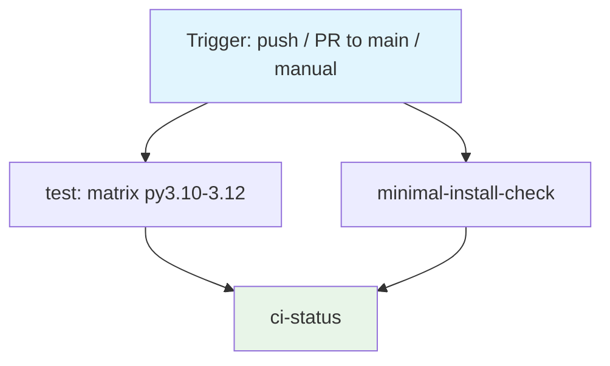

## Workflow Overview

**Purpose**: Verify, on every push and pull request, that the `datahub-yaml-source` plugin installs, its
`yaml` ingestion source registers, its full test suite passes across supported Python versions, and its
derived documentation/schema artifacts remain in sync with the Pydantic models they are generated from.

**Trigger Events**: Push to `main`; pull request targeting `main`; manual dispatch.

**Target Environments**: None (library/plugin package; no deployment target). CI-only, no release/publish
stage.

> **Status**: Implemented at `.github/workflows/ci.yml`. This document is the design contract that file
> must satisfy; changes to either should keep the other in sync, per Change Management below.

## Execution Flow Diagram



## Jobs & Dependencies

| Job Name | Purpose | Dependencies | Execution Context |
|----------|---------|--------------|-------------------|
| `test` | Install with dev extras; run unit + integration tests with coverage across the supported Python matrix. Transitively verifies generated-artifact freshness and golden-file stability (see REQ-002, REQ-003). | None | Linux runner, matrix over Python 3.10–3.12 |
| `minimal-install-check` | Install with base dependencies only (no optional extras); confirm the package imports and the `yaml` source plugin registers. | None | Linux runner, single Python version |
| `ci-status` | Aggregate gate: succeeds only if `test` (all matrix legs) and `minimal-install-check` succeed. Gives branch protection one stable required-check name. | `test`, `minimal-install-check` | Linux runner, no build steps |

## Requirements Matrix

### Functional Requirements

| ID | Requirement | Priority | Acceptance Criteria |
|----|-------------|----------|---------------------|
| REQ-001 | Install the package with its development extra on every supported Python version. | High | Install command completes with exit code 0 on each matrix leg. |
| REQ-002 | Run the full test suite (unit + integration). | High | All tests pass; suite includes tests that fail if generated docs/schema (`docs/sources/yaml/reference.md`, `docs/sources/yaml/schema/yaml-metadata.schema.json`) are stale relative to the Pydantic models in `models.py`. |
| REQ-003 | Verify the golden-file integration fixture is stable. | High | The golden-file comparison test passes without invoking any golden-file *update* mode. |
| REQ-004 | Enforce the documented coverage bar. | Medium | Coverage run reports ≥80% overall; build fails below threshold. |
| REQ-005 | Verify the package installs and its ingestion source registers using only mandatory (non-extra) dependencies. | High | A base-only install followed by a plugin-registration check confirms the `yaml` source is discoverable, without installing the `git` or `s3` extras. |
| REQ-006 | Run on a platform where the golden-file comparison exercises its primary (non-degraded) code path. | High | Primary execution environment is Linux. |
| REQ-007 | Aggregate all required checks under one named gate for branch protection. | Medium | A single job depends on every other required job and fails if any of them fails or is skipped. |

### Security Requirements

| ID | Requirement | Implementation Constraint |
|----|-------------|---------------------------|
| SEC-001 | Grant the workflow no more repository access than reading source. | Token permissions scoped to read-only contents; no write, no packages, no deployments scope. |
| SEC-002 | Require no secrets. | The workflow must not reference any repository or organization secret — the test suite is fully hermetic (no live DataHub instance, no cloud credentials, no registry credentials). |
| SEC-003 | Never let CI mutate golden/reference artifacts and treat that as passing. | The golden-file *update* mode must never be invoked in this workflow; only the read/compare mode runs. |

### Performance Requirements

| ID | Metric | Target | Measurement Method |
|----|-------|--------|---------------------|
| PERF-001 | Wall-clock time for the `test` job (single matrix leg) | Under 5 minutes | Time from checkout to job completion, excluding queue wait |
| PERF-002 | Superseded runs on the same ref are not left running | Redundant runs cancelled | New push to the same PR/branch cancels the previous in-flight run for that ref |
| PERF-003 | Dependency installation reuses cached wheels between runs when the dependency set is unchanged | Cache hit on unchanged `setup.py` | Install step reports a cache hit when `setup.py` is unchanged since the last run |

## Input/Output Contracts

### Inputs

```yaml
# Repository Triggers
paths: []          # no path filters; every push/PR is evaluated
branches: [main]   # push trigger scope
# Pull requests targeting `main` also trigger, regardless of source branch

# Environment Variables
# None required.

# Secrets
# None required.
```

### Outputs

```yaml
# Job Outputs
test_result: status            # Description: pass/fail per Python-version matrix leg
minimal_install_result: status # Description: pass/fail of the base-dependency install/registration check
ci_status: status               # Description: aggregate pass/fail consumed by branch protection
coverage_report: text           # Description: per-module coverage summary emitted to job logs
```

### Secrets & Variables

| Type | Name | Purpose | Scope |
|------|------|---------|-------|
| — | — | None required | — |

## Execution Constraints

### Runtime Constraints

- **Timeout**: Each job bounded to a fixed maximum (recommend 10 minutes) to fail fast on hangs rather than
  consuming runner time indefinitely.
- **Concurrency**: One in-flight run per ref; a new push cancels the previous run for the same ref (PERF-002).
- **Resource Limits**: Standard hosted Linux runner; no elevated compute required (no compilation of native
  extensions beyond what `pip install` resolves from wheels).
- **Checkout depth**: Every `actions/checkout` step uses `fetch-depth: 0` (full history + tags). The
  package version is derived from Git tags by `setuptools-scm` (`pyproject.toml` `[tool.setuptools_scm]`);
  under the default shallow clone `setuptools-scm` sees no tags and every install resolves to the
  `0.0.0` fallback. This is a build-input requirement, not a behavioural one — the test suite itself
  still contacts no network service.

### Environmental Constraints

- **Runner Requirements**: Linux (REQ-006). No Windows runner in the required path — Windows is excluded
  because the golden-file comparison falls back to a weaker structural check there (see Edge Cases).
- **Network Access**: Outbound access to the Python package index only, for dependency installation. No
  access to any DataHub instance, cloud storage, or git server is required — all such interactions in the
  test suite are simulated with in-process fakes.
- **Permissions**: Read-only repository contents (SEC-001).

## Error Handling Strategy

| Error Type | Response | Recovery Action |
|------------|----------|------------------|
| Dependency install failure | Fail the affected job immediately | Investigate dependency resolution (e.g. an incompatible `acryl-datahub` release); pin or adjust `setup.py` |
| Unit/integration test failure | Fail the `test` job for that matrix leg | Fix the failing code or test; re-run |
| Generated-artifact drift (docs/schema out of sync with models) | Fail via the dedicated drift-detection tests inside the `test` job | Regenerate `docs/sources/yaml/reference.md` and `docs/sources/yaml/schema/yaml-metadata.schema.json` from the current models and commit them alongside the model change |
| Golden-file mismatch | Fail via the golden-file comparison test | Review whether the output change is intentional; if so, regenerate the golden file locally and review the diff by hand before committing — never regenerate inside CI |
| Coverage below threshold | Fail the `test` job | Add tests for the newly uncovered lines, or justify and adjust the threshold deliberately |
| Minimal-install / plugin-registration failure | Fail `minimal-install-check` | Audit for a module-level import of an optional-extra dependency (`GitPython`, `boto3`) that should be lazy |
| Any required job failure | `ci-status` fails | Branch protection blocks merge until resolved |

## Quality Gates

### Gate Definitions

| Gate | Criteria | Bypass Conditions |
|------|----------|---------------------|
| Test suite | All unit and integration tests pass on every matrix leg | None |
| Coverage threshold | Overall coverage ≥80% | None; threshold change requires updating this specification |
| Generated-artifact freshness | Docs/schema match current model definitions | None |
| Golden-file stability | Integration fixture output matches the committed golden file | None — intentional changes require a reviewed, hand-committed golden-file update, not a bypass |
| Minimal-install integrity | Package imports and plugin registers using only mandatory dependencies | None |

## Monitoring & Observability

### Key Metrics

- **Success Rate**: Track `ci-status` pass rate on `main` over time; a healthy `main` should stay green.
- **Execution Time**: Track `test` job duration per matrix leg against PERF-001.
- **Resource Usage**: Not tracked beyond standard hosted-runner minutes consumption.

### Alerting

| Condition | Severity | Notification Target |
|-----------|----------|----------------------|
| `ci-status` fails on `main` (post-merge) | High | Repository maintainer(s) via default GitHub notification on the failing commit |
| Repeated flakiness in the `test` job across unrelated PRs | Medium | Repository maintainer(s), for investigation as a suite reliability issue |

## Integration Points

### External Systems

| System | Integration Type | Data Exchange | SLA Requirements |
|--------|-------------------|----------------|-------------------|
| Python Package Index | Dependency resolution | Package downloads at install time | Best-effort; no SLA — treated as a build-time dependency, not a runtime one |

No DataHub instance, cloud storage service, or external git host is contacted during this workflow: the
loader's git/S3/HTTP code paths are exercised in the test suite exclusively through in-process fakes.

### Dependent Workflows

| Workflow | Relationship | Trigger Mechanism |
|----------|---------------|---------------------|
| Release/publish (not yet specified) | Downstream, out of scope for this spec | Would depend on `ci-status` succeeding on `main`, if introduced |

## Compliance & Governance

### Audit Requirements

- **Execution Logs**: Retained per the hosting platform's default workflow-run retention; no custom
  retention policy required given the absence of secrets or sensitive data in logs.
- **Approval Gates**: None beyond standard pull-request review; this workflow provides the automated check
  that review can rely on.
- **Change Control**: Changes to gates described here (test scope, coverage threshold, Python matrix) must
  update this specification first, per the Change Management section below.

### Security Controls

- **Access Control**: Read-only `contents` permission (SEC-001); no write-scoped tokens.
- **Secret Management**: Not applicable — no secrets are used (SEC-002).
- **Vulnerability Scanning**: Not currently in scope for this workflow; dependency vulnerability scanning is
  a candidate future addition, not a current requirement.

## Edge Cases & Exceptions

### Scenario Matrix

| Scenario | Expected Behavior | Validation Method |
|----------|---------------------|------------------------|
| Run on a Windows runner | Not part of the required path. If run experimentally, the golden-file comparison degrades to a weaker structural check (a known limitation of the file sink's path handling on Windows), so a Windows leg must never be treated as equivalent evidence to the Linux leg. | Manual code inspection of the golden-file test's platform-conditional fallback; do not add Windows as a required check without addressing this. |
| PR modifies `models.py` without regenerating docs/schema | `test` job fails via the drift-detection tests | Confirmed by design: dedicated tests compare committed artifacts against freshly generated output |
| PR modifies `models.py` and regenerates docs/schema correctly | `test` job passes | Standard test run |
| Optional extra (`git`, `s3`) dependency accidentally imported at module level in core code | `minimal-install-check` fails at import time | Confirmed empirically: a base-only install (no extras) imports the plugin entry point successfully today |
| Contributor runs `--update-golden-files` locally and commits an unintended change | Not caught by this workflow directly — CI compares against whatever golden file is committed | Relies on human review of the golden-file diff, as instructed in `CONTRIBUTING.md` |
| Dependency floor (`acryl-datahub>=1.7.0`) resolves a newer release that drops a transitive dependency the code relies on (`requests`, `pydantic`) | Install or import may fail unpredictably | Not currently guarded by a pinned upper bound; a floating risk noted for future hardening, not fixed by this workflow alone |

## Validation Criteria

### Workflow Validation

- **VLD-001**: `test` job passes on all matrix legs (Python 3.10, 3.11, 3.12) using `pip install -e ".[dev]"`.
- **VLD-002**: `minimal-install-check` passes using a base install (`pip install .`, no extras) and confirms
  the `yaml` source is listed among registered ingestion source plugins.
- **VLD-003**: `ci-status` reports failure if either `test` or `minimal-install-check` fails, and success
  only when both succeed.
- **VLD-004**: No job in this workflow invokes any golden-file *update* mode.
- **VLD-005**: No job in this workflow references a secret.

### Performance Benchmarks

- **PERF-001** (restated): Single `test` matrix leg completes in under 5 minutes.
- **PERF-004**: Total workflow wall-clock time (slowest path, including matrix parallelism) stays under 10
  minutes under normal runner availability.

## Change Management

### Update Process

1. **Specification Update**: Modify this document first.
2. **Review & Approval**: Standard pull-request review of the specification change.
3. **Implementation**: Apply changes to `.github/workflows/ci.yml`.
4. **Testing**: Confirm the updated workflow satisfies the Validation Criteria above on a trial PR.
5. **Deployment**: Merge once the trial run demonstrates conformance.

### Version History

| Version | Date | Changes | Author |
|---------|------|---------|--------|
| 1.0 | 2026-08-16 | Initial specification, written against a repository with no existing CI workflow | David Ouagne |
| 1.1 | 2026-08-16 | Corrected the Python matrix from 3.9–3.12 to 3.10–3.12: `acryl-datahub>=1.7.0`, a mandatory dependency, itself requires Python >=3.10 (confirmed via its PyPI classifiers), so a 3.9 leg was unsatisfiable. Marked the workflow as implemented at `.github/workflows/ci.yml`. | David Ouagne |
| 1.2 | 2026-09-05 | Added `fetch-depth: 0` to both `actions/checkout` steps: the package version is now derived from Git tags by `setuptools-scm` (issue #3), which needs full history + tags rather than the default shallow clone. | David Ouagne |

## Related Specifications

- None yet. A future release/publish workflow specification, if introduced, should reference this document
  as its upstream gate.
