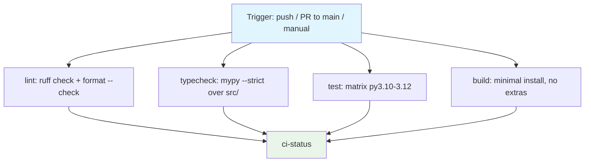

## Workflow Overview

**Purpose**: Verify, on every push and pull request, that the `datahub-yaml-source` plugin installs, its
`yaml` ingestion source registers, its full test suite passes across supported Python versions, its
derived documentation/schema artifacts remain in sync with the Pydantic models they are generated from,
and its first-party Python is clean under Ruff (lint + format) and mypy (strict type-check). The latter
two (`lint`/`typecheck` jobs) were absorbed from a formerly separate `quality.yml` workflow/spec (v1.12,
see "Why merged into one file" below) — `spec/spec-process-cicd-quality.md` is retired, its content
folded in here.

**Trigger Events**: Push to `main`; pull request targeting `main`; manual dispatch.

**Target Environments**: None (library/plugin package; no deployment target). CI-only, no release/publish
stage.

> **Status**: Implemented at `.github/workflows/ci.yml`. This document is the design contract that file
> must satisfy; changes to either should keep the other in sync, per Change Management below.

## Why merged into one file (v1.12)

Through v1.11, `ruff`/`mypy` lived in a separate `quality.yml` workflow (`spec/spec-process-cicd-quality.md`),
each individually promoted to a `main` required status check. The sibling repo
`datahub-healthdcat-ap-exporter` instead runs lint/typecheck as `lint`/`typecheck` jobs *inside* its own
`ci.yml`, feeding its `CI status` aggregate directly — only `CI status` (plus `dependency-review`) is a
required check there, not separate lint/type-check contexts. The maintainer, comparing the two repos'
live branch-protection settings directly, asked for this repo to match that structure so the two repos
expose the same required-check surface in the same place, easing future comparison. This version does
that: `quality.yml`'s jobs move into this file, renamed `lint`/`typecheck` (matching the sibling's own
names), and `ci-status` now aggregates all four (`lint`, `typecheck`, `test`, `build`) instead of two.
`main`'s required-status-checks list shrinks from `["CI status", "ruff", "mypy", "dependency-review"]` to
`["CI status", "dependency-review"]` — functionally identical (nothing that previously blocked merge
stops blocking; `ci-status` still fails if lint/typecheck fail), just consolidated under one name.
`spec/spec-process-cicd-quality.md` is retired to a redirect stub pointing here; its detailed tooling
rationale (Ruff/mypy config tables, the mypy-baseline-zero story, the issue #55 `ANN`/`PL` fix
breakdown) is reproduced in this document's "Lint & Type-Check Configuration" section below, not lost.

## Execution Flow Diagram



## Jobs & Dependencies

| Job Name | Purpose | Dependencies | Execution Context |
|----------|---------|--------------|-------------------|
| `lint` | `ruff check` (lint) + `ruff format --check` (format) over first-party Python (`src/`, `tests/`, `scripts/`). Absorbed from the retired `quality.yml`'s `ruff` job (renamed, v1.12); no longer individually required — feeds `ci-status`. | None | Linux runner, Python 3.12 |
| `typecheck` | `mypy` over `src/` per `[tool.mypy]` in `pyproject.toml` (`strict = true`). Absorbed from the retired `quality.yml`'s `mypy` job (renamed, v1.12); no longer individually required — feeds `ci-status`. | None | Linux runner, Python 3.12 |
| `test` | Install with dev extras; run unit + integration tests with coverage across the supported Python matrix. Transitively verifies generated-artifact freshness and golden-file stability (see REQ-002, REQ-003). | None | Linux runner, matrix over Python 3.10–3.12 |
| `build` | Install with base dependencies only (no optional extras); confirm the package imports and the `yaml` source plugin registers. Renamed from `minimal-install-check` (v1.12) to match the sibling repo's job id for the analogous (though not identical-content) step, for easier cross-repo diffing. | None | Linux runner, single Python version |
| `ci-status` (job id; **check-run name `CI status`**) | Aggregate gate: succeeds only if `lint`, `typecheck`, `test` (all matrix legs), and `build` succeed. Its `name:` — `CI status`, *with a space* — is the exact context string `main` branch protection requires (not the job id `ci-status`). | `lint`, `typecheck`, `test`, `build` | Linux runner, no build steps |

## Requirements Matrix

### Functional Requirements

| ID | Requirement | Priority | Acceptance Criteria |
|----|-------------|----------|---------------------|
| REQ-001 | Install the package with its development extra on every supported Python version. | High | Install command completes with exit code 0 on each matrix leg. |
| REQ-002 | Run the full test suite (unit + integration). | High | All tests pass; suite includes tests that fail if generated docs/schema (`docs/sources/yaml/reference.md`, `docs/sources/yaml/schema/yaml-metadata.schema.json`) are stale relative to the Pydantic models in `models.py`. |
| REQ-003 | Verify the golden-file integration fixture is stable. | High | The golden-file comparison test passes without invoking any golden-file *update* mode. |
| REQ-004 | Enforce the documented coverage bar. | Medium | Coverage run reports ≥80% overall; build fails below threshold. |
| REQ-005 | Verify the package installs and its ingestion source registers using only mandatory (non-extra) dependencies. | High | A base-only install followed by a plugin-registration check confirms the `yaml` source is discoverable, without installing the `git` or `s3` extras. |
| REQ-006 | Run on a platform where the golden-file comparison exercises its primary (non-degraded) code path. | High | Primary execution environment is Linux. |
| REQ-007 | Aggregate all required checks under one named gate for branch protection. | Medium | A single job depends on every other required job and fails if any of them fails or is skipped. |
| REQ-012 | Lint all first-party Python with Ruff. | High | `ruff check .` exits 0 in the `lint` job; any violation fails `ci-status`. |
| REQ-013 | Enforce a single auto-format. | High | `ruff format --check .` reports no file would be reformatted. |
| REQ-014 | Lint/format config is version-controlled and single-source. | High | `[tool.ruff]` lives in `pyproject.toml`; no competing `ruff.toml`/`setup.cfg` lint config exists. |
| REQ-015 | Tool versions match between CI and a local `uv sync --group dev`. | Medium | `ruff` and `mypy` are pinned in `pyproject.toml`'s `dev` dependency group; `lint`/`typecheck` install only that group, no ad-hoc tool install. |
| REQ-016 | Type-check the package source with mypy. | High | `typecheck` runs mypy against `files = ["src"]` with the `[tool.mypy]` config; a clean tree exits 0. |
| REQ-017 | A new type error blocks merge. | High | `typecheck` has no `continue-on-error`; a non-zero mypy exit fails it, and therefore `ci-status`. The baseline is zero (issue #13). |
| REQ-018 | Ruff also lints for missing annotations and pylint-style issues, scoped to `src/`. | High | `[tool.ruff.lint] select` includes `ANN`/`PL`; `tests/**`/`scripts/**` are exempted from both via `per-file-ignores` (issue #55). |
| REQ-019 | mypy runs in strict mode. | High | `[tool.mypy] strict = true`, scoped to `files = ["src"]`; a clean tree exits 0 (issue #55). |
| REQ-020 | Renaming `lint`/`typecheck` is a breaking change (unlike when they were individually required, it now only breaks the diagram/docs above, not branch protection directly — but still update this spec). | Low | This document's Jobs & Dependencies table and Execution Flow Diagram name them explicitly. |

### Security Requirements

| ID | Requirement | Implementation Constraint |
|----|-------------|---------------------------|
| SEC-001 | Grant the workflow no more repository access than reading source. | Token permissions scoped to read-only contents; no packages, no deployments scope. The one exception: the `test` job adds `id-token: write` for Codecov's OIDC upload (`spec/spec-process-cicd-codecov.md`) — an identity assertion that grants no write access to repository contents. See Security Controls. |
| SEC-002 | Require no secrets. | The workflow must not reference any repository or organization secret — the test suite is fully hermetic (no live DataHub instance, no cloud credentials, no registry credentials). |
| SEC-003 | Never let CI mutate golden/reference artifacts and treat that as passing. | The golden-file *update* mode must never be invoked in this workflow; only the read/compare mode runs. |

### Performance Requirements

| ID | Metric | Target | Measurement Method |
|----|-------|--------|---------------------|
| PERF-001 | Wall-clock time for the `test` job (single matrix leg) | Under 5 minutes | Time from checkout to job completion, excluding queue wait |
| PERF-002 | Superseded runs on the same ref are not left running | Redundant runs cancelled | New push to the same PR/branch cancels the previous in-flight run for that ref |
| PERF-003 | Dependency installation reuses cached wheels between runs when the dependency set is unchanged | Cache hit on unchanged `uv.lock` | `astral-sh/setup-uv`'s `enable-cache: true` reports a cache hit when `uv.lock` is unchanged since the last run |
| PERF-005 | Wall-clock time for the `lint` job | Under 3 minutes | Checkout to job completion, excluding queue wait |

## Input/Output Contracts

### Inputs

```yaml
# Repository Triggers
paths: []          # no path filters; every push/PR is evaluated
branches: [main]   # push trigger scope
# Pull requests targeting `main` also trigger, regardless of source branch

# Environment Variables
# None required.

# Secrets
# None. The `test` job additionally sets `permissions: id-token: write` for
# Codecov's OIDC coverage upload (spec/spec-process-cicd-codecov.md) -- an
# identity-assertion permission, not a repository or organization secret.
```

### Outputs

```yaml
# Job Outputs
test_result: status            # Description: pass/fail per Python-version matrix leg
minimal_install_result: status # Description: pass/fail of the base-dependency install/registration check
ci_status: status               # Description: aggregate pass/fail consumed by branch protection
coverage_report: text           # Description: per-module coverage summary emitted to job logs
coverage_xml: artifact          # Description: coverage.xml from each `test` leg, uploaded to Codecov (best-effort, non-fatal; spec/spec-process-cicd-codecov.md)
```

### Secrets & Variables

| Type | Name | Purpose | Scope |
|------|------|---------|-------|
| — | — | No repository secrets or variables. | — |
| Permission | `id-token: write` | GitHub OIDC exchange for the Codecov coverage upload (`spec/spec-process-cicd-codecov.md`) — a workflow permission, not a secret. | `test` job only |

## Execution Constraints

### Runtime Constraints

- **Timeout**: Each job bounded to a fixed maximum (recommend 10 minutes) to fail fast on hangs rather than
  consuming runner time indefinitely.
- **Concurrency**: One in-flight run per ref; a new push cancels the previous run for the same ref (PERF-002).
- **Resource Limits**: Standard hosted Linux runner; no elevated compute required (no compilation of native
  extensions beyond what `uv sync` resolves from wheels).
- **Checkout depth**: Every `actions/checkout` step uses `fetch-depth: 0` (full history + tags). The
  package version is derived from Git tags by `hatch-vcs` (`pyproject.toml` `[tool.hatch.version]`);
  under the default shallow clone `hatch-vcs` sees no tags and every install resolves to the
  `0.0.0` fallback. This is a build-input requirement, not a behavioural one — the test suite itself
  still contacts no network service.

### Environmental Constraints

- **Runner Requirements**: Linux (REQ-006). No Windows runner in the required path — Windows is excluded
  because the golden-file comparison falls back to a weaker structural check there (see Edge Cases).
- **Network Access**: Outbound access to the Python package index only, for dependency installation. No
  access to any DataHub instance, cloud storage, or git server is required — all such interactions in the
  test suite are simulated with in-process fakes.
- **Permissions**: Read-only repository contents (SEC-001).

## Lint & Type-Check Configuration (authoritative pointers)

Absorbed from the retired `spec/spec-process-cicd-quality.md` (v1.12, see "Why merged into one file"
above) — content unchanged from that spec's v1.5, only the job names (`ruff`→`lint`, `mypy`→`typecheck`)
and workflow file (`quality.yml`→`ci.yml`) references updated. The exact configuration lives in
`pyproject.toml`; this section records the decisions and their rationale.

### Ruff

| Setting | Value | Rationale |
|---------|-------|-----------|
| `line-length` | `100` | A deliberate loosening from the 88 default; the pre-existing code sat well above 88 and 100 keeps the one-off reformat from rewrapping nearly every signature. |
| `target-version` | `py310` | Matches `pyproject.toml`'s `requires-python` floor (driven by `acryl-datahub>=1.7.0`). |
| `lint.select` | `E`, `F`, `I`, `UP`, `B`, `C4`, `SIM`, `RUF`, `ANN`, `PL` | pycodestyle/pyflakes errors, import sorting, pyupgrade, bugbear, comprehensions, simplify, Ruff-native, plus annotation-completeness (`ANN`) and pylint (`PL`) — added by issue #55 to match the sibling repo's posture. `ANN`/`PL` are scoped to `src/` only via `lint.per-file-ignores` below, not narrowed at the `select` level, so a future `src/` file can't accidentally land unchecked. |
| `lint.per-file-ignores` | `__init__.py` → `F401`; `tests/**` → `E501`, `ANN`, `PL`; `scripts/**` → `ANN`, `PL` | Re-export modules use unused imports on purpose; test fixtures embed full DataHub URNs and JSON blobs as string literals that are not meaningfully breakable (the formatter still enforces 100 cols on everything it can reflow). `ANN`/`PL` are held to `src/` only (issue #55), mirroring `[tool.mypy] files = ["src"]` — annotating every test function/script would be a much larger, separate undertaking (387 violations outside `src/` vs. the 48 inside it that issue #55 actually fixed) with no matching safety payoff, since mypy never checks `tests/`/`scripts/` either. |
| `lint.isort.known-first-party` | `["datahub_yaml_source"]` | Correct first/third-party split in a `src/` layout. |
| `extend-exclude` | `["*.md"]` | Ruff's scope is first-party Python. Ruff 0.16 `ruff format` also reformats ` ```python ` blocks inside Markdown; the illustrative snippets in `_PLANNING.md` are hand-shaped, so prose docs are excluded from both `check` and `format`. |

Two `# noqa: E501` are carried in `src/datahub_yaml_source/models.py`: one on an aligned ASCII
capability matrix in a comment block (reflowing destroys the alignment) and one on a single-line class
docstring whose text is consumed verbatim by `scripts/generate_json_schema.py` (splitting it would
inject `\n` into the emitted JSON Schema).

**Generator coupling**: `scripts/generate_markdown_docs.py` renders the type column of
`docs/sources/yaml/reference.md` from the Pydantic field annotations in `models.py`. Ruff's `UP`
rules rewrote `Optional[X]`/`List[X]` to `X | None`/`list[X]`; `_render_type` was updated to treat
`types.UnionType` identically to `typing.Union` so the generated docs are byte-identical before and
after the reformat. Any future change to the `UP` rule set must be followed by regenerating the
schema + docs (per `AGENTS.md`) and confirming no drift.

### mypy

| Setting | Value | Rationale |
|---------|-------|-----------|
| `files` | `["src"]` | Package source only. `tests/` and `scripts/` are out of scope. |
| `python_version` | `"3.10"` | Assume the semantics of the supported floor. |
| `strict` | `true` | Issue #55: promoted from the non-strict baseline (`check_untyped_defs`/`warn_unused_ignores`/`warn_redundant_casts`, individually set) to `strict = true`, matching the sibling repo. `strict` is a superset that subsumes all three of those flags plus `disallow_untyped_defs`, `disallow_any_generics`, `warn_return_any`, `disallow_subclassing_any`, `no_implicit_reexport`, and more — they're no longer listed individually. |
| overrides: `datahub.*`, `deepdiff.*` | `ignore_missing_imports = true` | `acryl-datahub` ships partial/absent type information; without this the log is dominated by import errors rather than findings about our code. |
| overrides: `tests.*` | `disallow_untyped_defs = false` | Issue #55, mirroring the sibling repo. Currently a no-op in practice — `files = ["src"]` already keeps mypy off `tests/` entirely — kept so `files` can later be widened without silently demanding full annotation coverage in test code too. |

### mypy baseline: zero (issue #13)

At `spec/spec-process-cicd-quality.md` v1.0–1.1, `mypy` reported **31 errors across 11 files** (all
pre-existing; it was the first time mypy had run on the repo). Issue #13 drove that to **zero** and
flipped the job to blocking. The 31 broke down as: `list[str]` passed where the SDK types
`list[str | SomeUrn]` (fixed by widening our helper return annotations); `str | None` reaching a
`list[str]` / `str` param (fixed with explicit guards / `assert`s documenting a validator invariant);
`*Doc` passed where a `*Ref` was typed (fixed with structural `Protocol`s in `urns.py`);
`AssertionInfoClass(**payload)` (an intermediate `dict[str, Any]`); a stale 5-tuple `NaturalKey` alias
(aligned to the real 3-tuple); a duplicate `DisplayPropertiesDoc` class (deleted); `types-PyYAML` added
to the `dev` extra; and one genuine bug — a CUSTOM assertion passed a `SchemaFieldSpec` where `field=`
wants a schemaField URN string. No `mypy` baseline/ignore file, and **no `# type: ignore` comments** —
every error was resolved by a real annotation, guard, `cast`, or fix. `warn_unused_ignores` stays on so
any future suppression can't silently rot.

### ruff `ANN`/`PL` + mypy `strict = true` (issue #55)

A dry run against the pre-#55 codebase found 48 `ruff check src --select PL,ANN` violations and 18
`mypy --strict` errors (scoped to `src/`; `tests/`/`scripts/` were separately found to carry 387
`ANN`/`PL` violations, deliberately left out of scope — see the `lint.per-file-ignores` rationale
above). All 66 were fixed directly in the source; none were baselined or blanket-ignored, matching
the same discipline the mypy-baseline-zero effort (issue #13) established. Notable fixes, by shape:

- **Missing argument/return annotations** (the bulk of the `ANN` count): added directly, following
  this codebase's existing conventions where one already existed for the same shape — e.g.
  `index: ReferenceIndex, report: YamlSourceReport` (used throughout `builders/*.py` but missing on
  a few `builders/common.py` helpers), or a structural `Protocol` in `urns.py` for a `ref` parameter
  documented as "accepts anything with these fields."
- **`ANN401` (bare `Any` in a signature)**: fixed by narrowing to a real type wherever one existed
  (e.g. `dict | None` → `dict[str, str] | None` on `stringify_custom_properties`); kept as `Any` with
  a scoped `# noqa: ANN401` + one-line reason only for the small set of genuinely dynamic cases — a
  pydantic `mode="before"` validator's raw pre-validation input (`models.py`'s `_coerce_to_list`,
  `yaml_source_config.py`'s `_apply_clone_defaults`/`_https_clone_url`), and one structured-property
  value normalizer that's genuinely a heterogeneous scalar-or-list from freeform YAML.
- **`PLC0415` (import not at top-level)**: two of the three found are this connector's core
  lazy-import architecture (`yaml_source.py`'s `AwsConnectionConfig` import, gated behind the `s3`
  extra so a local-only recipe never needs `boto3` — see the module docstrings in `loader.py`/
  `yaml_source.py`, and this workflow's `build` job, which would fail if this were
  "fixed" by moving the import to module level); kept with a scoped `# noqa: PLC0415` + reason. The
  third (`import requests` inside a function, in both `loader.py` and `yaml_source.py`) was a **real
  fix**, not a suppression: `requests` is an unconditional base dependency (not extra-gated), so it
  was moved to a normal top-level import.
- **`PLR0912`/`PLR0915` (too many branches/statements)**: fixed by extraction, not suppression, in
  every case — `builders/common.py`'s `common_sdk_kwargs`/`common_aspect_mcps` (one helper function
  per `Has*` mixin they dispatch across); `loader.py`'s `ParsedRepository.add()` (one dispatcher
  method per doc-kind family, matching `yaml_source.py`'s own grouping, verified doc types don't
  subclass each other so exact-isinstance dispatch stays equivalent); `loader.py`'s `load_repository`
  (its read-one-URI and parse-one-URI's-documents halves extracted into their own functions);
  `yaml_source.py`'s `get_workunits_internal` (32 near-identical `for X_doc in repository.X: ...`
  blocks split into four `_<group>_workunits` methods by doc-kind family, order preserved exactly).
  Every extraction was verified to change zero behavior via the full 211-test suite, including the
  golden-file integration test, both before and after.
- **`PLR0913`/`PLR0917` (too many arguments)**: the two functions flagged (`common_aspect_mcps`,
  `load_repository`) were *not* refactored to bundle their arguments — each is already this
  connector's standard cross-cutting-aspect bundle (`entity_urn, doc, index, report, context`) or a
  public entry point exercised directly by ~25 test cases with independently-varying subsets of its
  7 knobs; a bundle object would add indirection with no matching real-world grouping. Kept with a
  scoped `# noqa: PLR0913[, PLR0917]` + reason on each, the same judgment call the sibling repo's own
  `ruff.lint.ignore` makes for this shape (there: a blanket ignore; here: two scoped ones, since only
  two functions in `src/` actually need it).
- **mypy strict-only findings**: mostly `[type-arg]` (bare `dict`/`set`/`tuple`/`deque` needing type
  parameters) and `[no-any-return]` (an untyped third-party `.read()` call flowing into a `bytes`
  return), fixed with real type parameters/annotations. Three `[arg-type]` findings were an
  `Optional`-returning aspect builder (e.g. `build_domains_aspect`) passed to `mcp_workunit`, which
  requires a non-`None` `_Aspect`: two (`builders/common.py`'s `_domain_mcps`,
  `builders/container.py`'s multi-owner fallback) are guaranteed non-`None` by a preceding check with
  no gap (`if x is None: raise AssertionError(...)`, not a bare `assert`, so the narrowing survives
  `python -O`, with a one-line reason each); the third
  (`builders/container.py`'s `dataPlatformInstance` follow-up) is **not** provably non-`None` —
  `ContainerRef.platform` is a required field but an empty string is still a valid `str`, so an
  `assert` there would (only for that degenerate input) newly crash instead of matching this
  connector's actual originally-latent behavior — fixed with `if dpi is not None:` instead, verified
  in code review. One `[arg-type]` false positive survived:
  `StatefulIngestionSourceBase.__init__` is hardcoded to
  `StatefulIngestionConfigBase[StatefulIngestionConfig]` rather than being itself generic, so
  `YamlSourceConfig`'s real (verified) subtype relationship (`StatefulStaleMetadataRemovalConfig`
  subclasses `StatefulIngestionConfig`) can't be expressed across the call boundary under Python's
  invariant `Generic` — the sole `# type: ignore[arg-type]` in this codebase, with a one-line reason
  at the call site. A NamedTuple field literally named `index` was renamed to `ref_index`
  (`builders/common.py`'s internal `_RefContext`) after mypy flagged it shadowing the inherited
  `tuple.index()` method.

Neither `ruff`'s `ANN`/`PL` families nor mypy's `strict = true` were added to `main`'s required
status checks as a separate step — both rode the then-existing `ruff`/`mypy` required-check names;
now that `lint`/`typecheck` feed `CI status` instead (v1.12), the same holds for that aggregate.

## Error Handling Strategy

| Error Type | Response | Recovery Action |
|------------|----------|------------------|
| Dependency install failure | Fail the affected job immediately | Investigate dependency resolution (e.g. an incompatible `acryl-datahub` release); pin or adjust `pyproject.toml`, then run `uv lock` and commit the updated `uv.lock` |
| Lint violation | Fail the `lint` job | Run `ruff check --fix .` locally; hand-fix what `--fix` won't. For `ANN`/`PL` specifically (issue #55): fix with a real annotation/refactor first; a `# noqa: <code>` is a last resort and needs a one-line reason, same bar as mypy's `# type: ignore` below. |
| Formatting difference | Fail the `lint` job | Run `ruff format .` locally and commit. |
| mypy error(s) | Fail the `typecheck` job | Fix the annotation/guard, or (last resort, with a justifying comment) `# type: ignore[<code>]`. |
| Unit/integration test failure | Fail the `test` job for that matrix leg | Fix the failing code or test; re-run |
| Generated-artifact drift (docs/schema out of sync with models) | Fail via the dedicated drift-detection tests inside the `test` job | Regenerate `docs/sources/yaml/reference.md` and `docs/sources/yaml/schema/yaml-metadata.schema.json` from the current models and commit them alongside the model change |
| Golden-file mismatch | Fail via the golden-file comparison test | Review whether the output change is intentional; if so, regenerate the golden file locally and review the diff by hand before committing — never regenerate inside CI |
| Coverage below threshold | Fail the `test` job | Add tests for the newly uncovered lines, or justify and adjust the threshold deliberately |
| Minimal-install / plugin-registration failure | Fail `build` | Audit for a module-level import of an optional-extra dependency (`GitPython`, `boto3`) that should be lazy |
| Any required job failure | `CI status` (the `ci-status` job) fails | Branch protection blocks merge until resolved |

## Quality Gates

### Gate Definitions

| Gate | Criteria | Bypass Conditions |
|------|----------|---------------------|
| Lint | `ruff check .` clean (`lint` job) | None; rule-set changes require updating this specification. |
| Format | `ruff format --check .` clean (`lint` job) | None. |
| Types | `mypy` exits 0 over `src/` (`typecheck` job) | None; the baseline is zero. New errors must be fixed, not suppressed without cause. |
| Test suite | All unit and integration tests pass on every matrix leg | None |
| Coverage threshold | Overall coverage ≥80% | None; threshold change requires updating this specification |
| Generated-artifact freshness | Docs/schema match current model definitions | None |
| Golden-file stability | Integration fixture output matches the committed golden file | None — intentional changes require a reviewed, hand-committed golden-file update, not a bypass |
| Minimal-install integrity | Package imports and plugin registers using only mandatory dependencies (`build` job) | None |

## Monitoring & Observability

### Key Metrics

- **Success Rate**: Track `CI status` pass rate on `main` over time; a healthy `main` should stay green.
- **Execution Time**: Track `test` job duration per matrix leg against PERF-001.
- **Resource Usage**: Not tracked beyond standard hosted-runner minutes consumption.

### Alerting

| Condition | Severity | Notification Target |
|-----------|----------|----------------------|
| `CI status` fails on `main` (post-merge) | High | Repository maintainer(s) via default GitHub notification on the failing commit |
| Repeated flakiness in the `test` job across unrelated PRs | Medium | Repository maintainer(s), for investigation as a suite reliability issue |

## Integration Points

### External Systems

| System | Integration Type | Data Exchange | SLA Requirements |
|--------|-------------------|----------------|-------------------|
| Python Package Index | Dependency resolution | Package downloads at install time | Best-effort; no SLA — treated as a build-time dependency, not a runtime one |

No DataHub instance, cloud storage service, or external git host is contacted during this workflow: the
loader's git/S3/HTTP code paths are exercised in the test suite exclusively through in-process fakes.

### Dependent Workflows

| Workflow | Relationship | Trigger Mechanism |
|----------|---------------|---------------------|
| Release (`spec/spec-process-cicd-release.md`) | Its `release-please` job's downstream `build`/`pypi-publish`/`smoke` jobs run on the same `push: branches: [main]` event as this workflow, independently — not chained, but the release PR itself was already gated by `CI status` before merge | Same `push` event, independent workflow run |
| Dependabot (`.github/dependabot.yml`, `spec/spec-process-cicd-dependabot.md`) | Upstream PR producer — opens weekly grouped dependency-update PRs that this workflow gates before merge (`lint`/`typecheck` folded in as of v1.12, formerly a separate `quality.yml`) | Dependabot's own weekly schedule; resulting PRs trigger this workflow via `pull_request` to `main` |
| Dependabot auto-merge (`.github/workflows/dependabot-auto-merge.yml`, `spec/spec-process-cicd-dependabot-auto-merge.md`) | Downstream consumer of this workflow's `CI status` gate — for low-risk Dependabot PRs it calls `gh pr merge --auto`, which merges only once this workflow reports success | Runs on the same `pull_request` event as this workflow, independently |

### Branch protection on `main` (issue #9)

`main` is protected with **required status checks only** — the posture chosen for a single
maintainer with no second reviewer available:

| Setting | Value | Rationale |
|---------|-------|-----------|
| Required status checks | exactly **`CI status`** (this workflow's aggregate gate — now including `lint`/`typecheck` as of v1.12) and **`dependency-review`** (`spec/spec-process-cicd-dependency-review.md`) | The two blocking gate names. Match the sibling repo `datahub-healthdcat-ap-exporter`'s own required-checks list exactly (`["CI status", "dependency-review"]`), by deliberate design as of v1.12. Names are the check-run `name:` values, matched verbatim. |
| `strict` (require branch up to date before merge) | `false` | Would force every open PR — including the batch of Dependabot PRs — to be updated after each merge; not worth the friction for one maintainer. |
| CodeQL / `Analyze (*)` | **not required** | Advisory only at this stage (map issue #1 Notes; `spec/spec-process-cicd-codeql.md`). |
| `required_pull_request_reviews` | none | No second reviewer exists; a review requirement would be self-blocking. |
| `enforce_admins` | `false` | The maintainer keeps a direct-push escape hatch to avoid locking themselves out. |
| `restrictions` | none | Single maintainer; no push allow-list needed. |

Renaming `CI status` or `dependency-review` is a breaking change: update this list and re-apply the
protection. Applied via `PUT /repos/davidouagne/datahub-yaml-source/branches/main/protection`. History:
`mypy` was added as its own required check when promoted to blocking (issue #13); `dependency-review`
was added later (`spec/spec-process-cicd-dependency-review.md` v1.2) — deliberately advisory-only when
issue #57 first landed it, then promoted once the maintainer noticed, comparing live settings against
the sibling repo directly, that the sibling's own `main` had started requiring it and this repo's
"matches the sibling" justification had gone stale; then (v1.12) `ruff`/`mypy` were folded into `CI
status` (renamed `lint`/`typecheck`) and dropped from this list individually, again to match the
sibling's structure, arriving at the current two-entry list.

## Compliance & Governance

### Audit Requirements

- **Execution Logs**: Retained per the hosting platform's default workflow-run retention; no custom
  retention policy required given the absence of secrets or sensitive data in logs.
- **Approval Gates**: None beyond standard pull-request review; this workflow provides the automated check
  that review can rely on.
- **Change Control**: Changes to gates described here (test scope, coverage threshold, Python matrix) must
  update this specification first, per the Change Management section below.

### Security Controls

- **Access Control**: Workflow-level `contents: read` (SEC-001). The `test` job additionally sets
  `id-token: write` — required for Codecov's OIDC coverage upload
  (`spec/spec-process-cicd-codecov.md`) and the sole exception to "no write-scoped tokens".
  `id-token: write` mints a short-lived OIDC identity assertion; it confers no write access to
  repository contents, releases, or packages. `lint`, `typecheck`, `build`, and `ci-status` remain
  read-only. Job-level `permissions` replace rather than merge the workflow default, so the `test`
  job restates `contents: read` alongside `id-token: write`.
- **Secret Management**: No secrets are used (SEC-002). Codecov uploads authenticate via GitHub OIDC,
  not a stored `CODECOV_TOKEN`.
- **Vulnerability Scanning**: Not currently in scope for this workflow; dependency vulnerability scanning is
  a candidate future addition, not a current requirement.

## Edge Cases & Exceptions

### Scenario Matrix

| Scenario | Expected Behavior | Validation Method |
|----------|---------------------|------------------------|
| Run on a Windows runner | Not part of the required path. If run experimentally, the golden-file comparison degrades to a weaker structural check (a known limitation of the file sink's path handling on Windows), so a Windows leg must never be treated as equivalent evidence to the Linux leg. | Manual code inspection of the golden-file test's platform-conditional fallback; do not add Windows as a required check without addressing this. |
| PR modifies `models.py` without regenerating docs/schema | `test` job fails via the drift-detection tests | Confirmed by design: dedicated tests compare committed artifacts against freshly generated output |
| PR modifies `models.py` and regenerates docs/schema correctly | `test` job passes | Standard test run |
| Optional extra (`git`, `s3`) dependency accidentally imported at module level in core code | `build` fails at import time | Confirmed empirically: a base-only install (no extras) imports the plugin entry point successfully today |
| Contributor runs `--update-golden-files` locally and commits an unintended change | Not caught by this workflow directly — CI compares against whatever golden file is committed | Relies on human review of the golden-file diff, as instructed in `CONTRIBUTING.md` |
| A new `acryl-datahub` release within the pinned range (`>=1.7.0.9,<1.8`) breaks the experimental `datahub.sdk.*` surface this connector builds on | `test` job fails on the affected leg | The `<1.8` upper bound (issue #12) contains the blast radius to a minor; Dependabot opens the bump as its own PR (`spec/spec-process-cicd-dependabot.md`), reviewed by hand. A break inside the patch range still needs a fix + a tighter pin, as in #11/#12. |
| Codecov upload fails, is rate-limited, or runs from a fork PR (no OIDC token) | The `codecov/codecov-action` step is non-fatal (`fail_ci_if_error: false`); the `test` job and `CI status` stay green. Coverage history simply has a gap for that commit. | Confirmed by design; `spec/spec-process-cicd-codecov.md` REQ-005 / VLD-006. |

## Validation Criteria

### Workflow Validation

- **VLD-001**: `test` job passes on all matrix legs (Python 3.10, 3.11, 3.12) using
  `uv sync --frozen --group dev --extra git --extra s3`.
- **VLD-002**: `build` passes using a base install (a built wheel installed into a fresh
  venv via `uv build --wheel` + `uv pip install`, no extras, no dev group) and confirms the `yaml` source
  is listed among registered ingestion source plugins.
- **VLD-003**: `ci-status` reports failure if any of `lint`, `typecheck`, `test`, or `build` fails, and
  success only when all four succeed.
- **VLD-004**: No job in this workflow invokes any golden-file *update* mode.
- **VLD-005**: No job in this workflow references a secret.
- **VLD-006**: On a branch with a deliberate lint violation, the `lint` job fails.
- **VLD-007**: On a branch with an unformatted file, the `lint` job fails with a diff in the log.
- **VLD-008**: On a branch that adds a new mypy error, the `typecheck` job fails.
- **VLD-009**: `uv sync --frozen --group dev` on a clean checkout provides `ruff` and `mypy` at the
  versions `lint`/`typecheck` run.
- **VLD-010**: `uv run ruff check src --select PL,ANN` and `uv run mypy` both exit 0 against `src/`
  with no baseline file and no blanket per-file ignore for `ANN`/`PL`/strict findings (issue #55) —
  only scoped, single-line-justified `# noqa`/`# type: ignore` comments, individually reviewable in
  the "Lint & Type-Check Configuration" section above.

### Performance Benchmarks

- **PERF-001** (restated): Single `test` matrix leg completes in under 5 minutes.
- **PERF-004**: Total workflow wall-clock time (slowest path, including matrix parallelism) stays under 10
  minutes under normal runner availability.

## Change Management

### Update Process

1. **Specification Update**: Modify this document first.
2. **Review & Approval**: Standard pull-request review of the specification change.
3. **Implementation**: Apply changes to `.github/workflows/ci.yml`.
4. **Testing**: Confirm the updated workflow satisfies the Validation Criteria above on a trial PR.
5. **Deployment**: Merge once the trial run demonstrates conformance.

### Version History

| Version | Date | Changes | Author |
|---------|------|---------|--------|
| 1.0 | 2026-08-16 | Initial specification, written against a repository with no existing CI workflow | David Ouagne |
| 1.1 | 2026-08-16 | Corrected the Python matrix from 3.9–3.12 to 3.10–3.12: `acryl-datahub>=1.7.0`, a mandatory dependency, itself requires Python >=3.10 (confirmed via its PyPI classifiers), so a 3.9 leg was unsatisfiable. Marked the workflow as implemented at `.github/workflows/ci.yml`. | David Ouagne |
| 1.2 | 2026-09-05 | Added `fetch-depth: 0` to both `actions/checkout` steps: the package version is now derived from Git tags by `setuptools-scm` (issue #3), which needs full history + tags rather than the default shallow clone. | David Ouagne |
| 1.3 | 2026-09-07 | Dependent Workflows table: added Dependabot (`.github/dependabot.yml`, issue #6) as an upstream PR producer this workflow gates; refreshed the stale "Release/publish (not yet specified)" row to point at the now-existing `spec/spec-process-cicd-release.md`. No workflow-file change. | David Ouagne |
| 1.4 | 2026-09-07 | Documented `main` branch protection (issue #9): new "Branch protection on `main`" subsection with the concrete config (required checks `CI status` + `ruff` only; `strict: false`; no required reviews; `enforce_admins: false`). Corrected the recurring `ci-status` → `CI status` conflation — branch protection matches the job's `name:` (`CI status`, with a space), not the job id `ci-status`. No workflow-file change. | David Ouagne |
| 1.5 | 2026-09-07 | Refreshed the `acryl-datahub` dependency-range Edge Case row: the floor is now `>=1.7.0.9,<1.8` (issue #12 lifted the `<1.7.0.5` stopgap and kept a `<1.8` bound). No workflow-file change. | David Ouagne |
| 1.6 | 2026-09-07 | Added `mypy` to `main`'s required status checks (issue #13 promoted it to blocking). No workflow-file change in *this* spec's scope (`ci.yml` untouched). | David Ouagne |
| 1.7 | 2026-09-07 | The `test` job will also emit `coverage.xml` (`--cov-report=xml`) and upload it to Codecov via `codecov/codecov-action` using GitHub OIDC (`id-token: write` on `test`; no stored token). Reporting only — no new required check, `--cov-fail-under=80` unchanged. Contract in the new `spec/spec-process-cicd-codecov.md`; the `ci.yml` change itself is deferred to wayfinder map issue #40's wiring ticket. This revision records the Secrets/Outputs/Security-Controls/Edge-Case impact and refreshes the stale "None yet" Related Specifications stub. | David Ouagne |
| 1.8 | 2026-09-07 | Workflow-file change: the `test` job now runs `pytest ... --cov-report=xml`, sets job-level `permissions: {contents: read, id-token: write}`, and has a `codecov/codecov-action@v5` upload step (`use_oidc: true`, `flags: py${{ matrix.python-version }}`, `fail_ci_if_error: false`, `if: always()`). Implements what 1.7 specified; `spec/spec-process-cicd-codecov.md` → 1.1 in the same change. `CI status` still aggregates only `test` + `minimal-install-check`; the Codecov step cannot fail the job. | David Ouagne |
| 1.9 | 2026-09-14 | Migrated from `pip`/`setup.py` to `uv`/`pyproject.toml` (`datahub-yaml-source`#49): `test` installs via `uv sync --frozen --group dev --extra git --extra s3` and runs tests via `uv run pytest`; `minimal-install-check` now builds the wheel with `uv build --wheel` and installs it into a fresh venv (`uv venv` + `uv pip install`) instead of `pip install .`, closer proof of what an actual consumer of the published package gets. Version derivation moved from `setuptools-scm` to `hatch-vcs` (same underlying scheme options), so every reference to the former is now the latter. `astral-sh/setup-uv`'s own cache (keyed on `uv.lock`) replaces `actions/setup-python`'s pip cache (keyed on `setup.py`). No change to jobs, gates, matrix, or `CI status`'s aggregation. | David Ouagne |
| 1.10 | 2026-09-15 | Dependent Workflows table: added Dependabot auto-merge (`.github/workflows/dependabot-auto-merge.yml`, issue #51) as a downstream consumer of this workflow's `CI status` gate. No workflow-file change in *this* spec's scope (`ci.yml` untouched). | David Ouagne |
| 1.11 | 2026-09-15 | Branch protection on `main`: added `dependency-review` (`spec/spec-process-cicd-dependency-review.md` v1.2) to the required-status-checks list, promoting it from advisory. Applied via `PUT /repos/davidouagne/datahub-yaml-source/branches/main/protection`; see that spec's own version history for why (the maintainer caught, by comparing live settings against the sibling repo directly, that a "matches the sibling's advisory posture" justification had gone stale once the sibling's own branch protection changed independently). No workflow-file change in *this* spec's scope (`ci.yml` untouched — the required-checks list is a branch-protection setting, not part of this workflow file). | David Ouagne |
| 1.12 | 2026-09-15 | **Merged `quality.yml` into `ci.yml`** (see "Why merged into one file" above), prompted by the maintainer comparing this repo's CI job/check structure against the sibling repo directly. `ruff`/`mypy` jobs moved here, renamed `lint`/`typecheck` to match the sibling's own job names; `minimal-install-check` renamed `build` for the same cross-repo-diffing reason. `ci-status` now aggregates `[lint, typecheck, test, build]` (was `[test, minimal-install-check]`). `main`'s required-status-checks list changed from `["CI status", "ruff", "mypy", "dependency-review"]` to `["CI status", "dependency-review"]` (applied via `PUT /repos/davidouagne/datahub-yaml-source/branches/main/protection`) — `lint`/`typecheck` are no longer individually required, but still block merge transitively through `ci-status`, so this is a consolidation, not a weakening. `spec/spec-process-cicd-quality.md` retired to a redirect stub; its full content (Ruff/mypy config tables, mypy-baseline-zero story, issue #55 `ANN`/`PL` breakdown) reproduced verbatim (job-name references updated) in the new "Lint & Type-Check Configuration" section of this document, so none of that detail was lost. Every `minimal-install-check` reference in this spec updated to `build`. | David Ouagne |

## Related Specifications

- `spec/spec-process-cicd-codecov.md` — Codecov coverage **reporting**. Appends a `coverage.xml` upload
  step to this workflow's `test` job; adds no required check. This spec owns the coverage *gate*
  (`--cov-fail-under=80`, REQ-004); that one owns publishing the number.
- `spec/spec-process-cicd-quality.md` — **retired (v1.6), merged into this document**; kept only as a
  redirect stub with its own version history preserved for the record.
- `spec/spec-process-cicd-dependency-review.md` — `dependency-review`; also blocking as of v1.2, gates
  `main` alongside this workflow's `CI status`.
- `spec/spec-process-cicd-codeql.md` — CodeQL SAST; advisory, gates nothing.
- `spec/spec-process-cicd-dependabot.md` — upstream PR producer that this workflow gates.
- `spec/spec-process-cicd-release.md` — release pipeline; its `build+verify` job re-runs this suite on
  the tagged commit before publishing.
