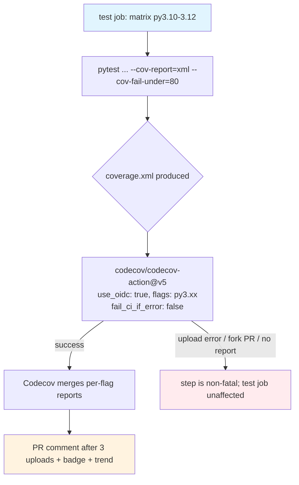

## Workflow Overview

**Purpose**: Publish the coverage the CI `test` job already measures to
[Codecov](https://about.codecov.io/) on every push and pull request to `main`, so
pull requests get an automated patch-coverage comment and the repository carries a
coverage badge and trend history. **Reporting only** — Codecov does not gate
merges. The hard coverage gate stays `pytest --cov-fail-under=80` inside the
`test` job (`spec/spec-process-cicd-ci.md`, REQ-004).

**Trigger Events**: None of its own. The Codecov upload is a step appended to the
existing `test` matrix job in `.github/workflows/ci.yml` (push to `main`; pull
request targeting `main`; manual dispatch).

**Target Environments**: None. Reporting only, no deployment target.

> **Status**: The `.github/workflows/ci.yml` integration this document specifies is
> **not yet implemented**. It lands in the wayfinder wiring ticket (map issue #40,
> child "Wire codecov-action into the test job + commit codecov.yml"). Until that
> merges, this document is the contract that change must satisfy, not a description
> of a running integration. The Codecov side is already provisioned: the Codecov
> GitHub App is installed on `davidouagne/datahub-yaml-source`, auth is GitHub
> OIDC, and no upload token is stored (map issue #40, "Provision Codecov").

## Execution Flow Diagram



## Configuration (authoritative pointers)

Two configuration surfaces, both landing in the wiring ticket:

1. The upload step in `.github/workflows/ci.yml` (the `test` job).
2. `codecov.yml` at the repository root — Codecov's own behaviour (commit
   statuses, PR comment). Once committed, that file is authoritative for
   everything in the "`codecov.yml` contents" table below; this spec records the
   intent and rationale, the same way `spec/spec-process-cicd-ci.md` records the
   intent behind `ci.yml`.

Codecov project settings live in the Codecov dashboard for
`davidouagne/datahub-yaml-source`; this repo stores no Codecov API token, so they
are read through the Codecov UI. The decisions that matter are captured below.

### Workflow step (intended)

Appended to the `test` job in `.github/workflows/ci.yml`, after the existing
"Run tests with coverage" step:

```yaml
      - name: Upload coverage to Codecov
        if: ${{ always() }}
        uses: codecov/codecov-action@v5
        with:
          use_oidc: true
          flags: py${{ matrix.python-version }}
          fail_ci_if_error: false
          # files: ./coverage.xml is auto-discovered; left implicit
```

The `test` job gains a **job-level** `permissions` block. Job-level `permissions`
*replace* the workflow-level grant rather than merging with it, so `contents:
read` must be restated or the checkout step loses read access:

```yaml
    permissions:
      contents: read     # unchanged intent; restated because job-level permissions replace, not merge
      id-token: write     # Codecov OIDC exchange -- see Security Requirements
```

The pytest invocation gains `--cov-report=xml` (keeping `term-missing` and the
`--cov-fail-under=80` gate):

```
python -m pytest tests/unit tests/integration \
  --cov=datahub_yaml_source --cov-report=term-missing --cov-report=xml \
  --cov-fail-under=80
```

`coverage.xml` is written to the repo root and is a build artifact only — it is
covered by `.gitignore` (`*.xml` is not currently ignored, so the wiring ticket
adds a `coverage.xml` line).

| Setting | Value | Rationale |
|---------|-------|-----------|
| action | `codecov/codecov-action@v5` | v5 is the current major. Pinned by **major-version tag**, consistent with `actions/checkout@v7` / `actions/setup-python@v7` in the same file; Dependabot's `github-actions` ecosystem (`spec/spec-process-cicd-dependabot.md`) keeps it current. |
| `use_oidc` | `true` | GitHub OIDC exchange instead of an upload token — no `CODECOV_TOKEN` to store or rotate. Any token input is ignored when this is set. |
| `flags` | `py${{ matrix.python-version }}` → `py3.10` / `py3.11` / `py3.12` | All three matrix legs upload; Codecov merges them into one report and keeps per-flag breakdowns. Cheapest correct option — no extra job, no re-run of the suite. |
| `fail_ci_if_error` | `false` | A Codecov outage, a rate-limit, a missing report, or a fork-PR run with no OIDC token must never fail the `test` job or `CI status`. This is what "reporting only" means in practice. |
| `if` | `always()` | Upload even when a test leg fails, so the coverage of a red PR is still visible. |
| `files` | implicit | `coverage.xml` at the repo root is auto-discovered by the action. |
| job `permissions` | `contents: read` + `id-token: write`, on the `test` job only | Minimum for the OIDC exchange. `minimal-install-check` and `ci-status` are untouched and stay at the workflow default. |

### `codecov.yml` contents (intended)

```yaml
codecov:
  require_ci_to_pass: true

coverage:
  status:
    project:
      default:
        informational: true
    patch:
      default:
        informational: true

comment:
  layout: "reach, diff, flags, files"
  require_changes: true
  after_n_builds: 3

github_checks:
  annotations: false
```

| Key | Value | Rationale |
|-----|-------|-----------|
| `coverage.status.project.default.informational` | `true` | Codecov still posts a `codecov/project` commit status, but `informational` makes it always succeed — signal, never a gate. `main` branch protection does not list it (see Integration Points). |
| `coverage.status.patch.default.informational` | `true` | Same for `codecov/patch`. Patch coverage is the number worth watching on a PR, but it advises; it does not block. |
| `comment.after_n_builds` | `3` | Wait for all three matrix legs to upload before settling the PR comment, so the number does not flap as legs report in. |
| `comment.require_changes` | `true` | Only comment when coverage actually moved — keeps no-op PRs quiet. |
| `comment.layout` | `reach, diff, flags, files` | Includes the per-Python-version `flags` block, which is the reason all three legs upload. |
| `github_checks.annotations` | `false` | No inline "line not covered" annotations on the diff — noisy; the PR comment is enough. |
| `codecov.require_ci_to_pass` | `true` | Codecov holds its status and comment until the repo's CI concludes, so it never reports on a half-finished run. |

## Requirements Matrix

### Functional Requirements

| ID | Requirement | Priority | Acceptance Criteria |
|----|-------------|----------|---------------------|
| REQ-001 | Coverage from every `test` matrix leg reaches Codecov. | High | After a push to `main`, `app.codecov.io/gh/davidouagne/datahub-yaml-source` shows an upload for each of `py3.10`, `py3.11`, `py3.12`. |
| REQ-002 | Pull requests get an automated coverage comment. | Medium | A PR that changes covered code gets one Codecov comment, posted after the third leg uploads, showing patch coverage. |
| REQ-003 | The repository shows a coverage badge. | Low | The README badge row renders a Codecov badge resolving a real percentage (not "unknown") for `main`. |
| REQ-004 | Codecov never blocks a merge. | High | `codecov/project` and `codecov/patch` are `informational` and are not in `main`'s required status checks; `pytest --cov-fail-under=80` remains the only coverage gate (`spec/spec-process-cicd-ci.md` REQ-004). |
| REQ-005 | A Codecov failure never fails CI. | High | With `fail_ci_if_error: false`, a simulated upload error (or a fork-PR run) leaves the `test` job and `CI status` green. |
| REQ-006 | No Codecov credential is stored in the repository. | High | `gh secret list` shows no `CODECOV_TOKEN`; auth is GitHub OIDC (`use_oidc: true`). |

### Security Requirements

| ID | Requirement | Implementation Constraint |
|----|-------------|---------------------------|
| SEC-001 | No stored Codecov credential. | OIDC only. `codecov-action` exchanges a short-lived GitHub OIDC token for a one-shot Codecov upload credential; nothing is persisted in repository or organization secrets. |
| SEC-002 | Smallest possible token-permission increase. | Only the `test` job gains `id-token: write`, and only because the OIDC exchange requires it. `id-token: write` mints an identity assertion — it grants no write access to repository contents, releases, or packages. This is the single documented exception to `spec/spec-process-cicd-ci.md` SEC-001's "no write-scoped tokens"; that spec's Security Controls section is amended to record it. |
| SEC-003 | A PR cannot weaken the coverage gate by editing Codecov config. | The real gate is `--cov-fail-under=80` in `ci.yml`, under `spec/spec-process-cicd-ci.md`'s change control. Editing `codecov.yml` can only change advisory reporting; it cannot make a red coverage run merge-able. |
| SEC-004 | Fork PRs cannot exfiltrate anything via Codecov. | GitHub does not issue a writable OIDC token to `pull_request` runs from forks, so the upload step no-ops for them. No secret is exposed to fork runs by any path. |

### Performance Requirements

| ID | Metric | Target | Measurement Method |
|----|-------|--------|---------------------|
| PERF-001 | Wall-clock added to a `test` matrix leg by the upload step | Under ~30 seconds | Step duration in the Actions log. |
| PERF-002 | Maintenance cost | Near zero | One action, major-version-pinned and Dependabot-bumped; one `codecov.yml`. No matrix or bespoke job to maintain. |

## Error Handling Strategy

| Error Type | Response | Recovery Action |
|------------|----------|------------------|
| Codecov API down / rate-limited | Upload step logs the error and exits 0 (`fail_ci_if_error: false`); `test` and `CI status` unaffected | None required; the next push re-uploads. Coverage history has a gap for that commit. |
| `coverage.xml` missing (pytest changed or failed before writing it) | `codecov-action` reports "no coverage reports found" and, being non-fatal, still exits 0 | Fix the pytest invocation so `--cov-report=xml` runs; the drift shows as a missing upload on the Codecov dashboard. |
| Fork-PR run (no OIDC token) | Upload step no-ops | Expected. Patch coverage for external contributions is picked up after merge to `main`. |
| Codecov comment or status not appearing | Not a merge blocker (informational) | Check the Codecov GitHub App is still installed and that `require_ci_to_pass` is being satisfied. |
| A `codecov/*` context is added to `main`'s required checks without a spec change | Merges start blocking on a third-party upload | Revert the branch-protection change; promoting Codecov to a gate is a documented breaking change (Change Management). |

## Quality Gates

| Gate | Criteria | Bypass Conditions |
|------|----------|---------------------|
| Coverage upload | `codecov-action` runs on each `test` leg and, network permitting, uploads `coverage.xml` | Never a merge gate. A failed or skipped upload does not block merge, by design (REQ-005). |
| Coverage threshold | **Owned by `spec/spec-process-cicd-ci.md`** (REQ-004): `pytest --cov-fail-under=80` in the `test` job. Codecov neither duplicates nor replaces it. | See that spec. |

Promoting a Codecov status (`codecov/project` or `codecov/patch`) to a
**required** check on `main` is a breaking change: it needs a revision of this
spec (drop `informational`) **and** a `main` branch-protection change
(`spec/spec-process-cicd-ci.md`). Tracked as fog on the wayfinder map (issue #40,
"Not yet specified").

## Integration Points

### External Systems

| System | Integration Type | Data Exchange | SLA Requirements |
|--------|-------------------|----------------|-------------------|
| Codecov (`app.codecov.io`) | Coverage report upload + PR annotation | `coverage.xml` uploaded per matrix leg over HTTPS by `codecov-action`; Codecov posts a commit status and a PR comment back through its GitHub App | Best-effort. No SLA; `fail_ci_if_error: false` keeps the dependency non-blocking. |
| GitHub OIDC provider | Authentication | The `test` job requests an OIDC token (`id-token: write`); `codecov-action` exchanges it for a one-shot upload credential | Part of GitHub Actions; no separate SLA. |
| Codecov GitHub App | PR comment + commit status + badge data | Installed on `davidouagne/datahub-yaml-source`; no repo secret | Best-effort. |

### Dependent Workflows

| Workflow | Relationship | Trigger Mechanism |
|----------|---------------|---------------------|
| CI (`spec/spec-process-cicd-ci.md`) | **Host.** The upload is a step in CI's `test` job; this spec adds `--cov-report=xml`, an `id-token: write` job permission, and the upload step. CI owns the coverage *gate*; this spec owns the *reporting*. | Same `test` job run |
| Quality (`spec/spec-process-cicd-quality.md`) | None — `ruff` / `mypy` produce no coverage. | n/a |
| Branch protection on `main` | **Not coupled.** `codecov/*` statuses are `informational` and excluded from required checks — the same posture CodeQL has. | n/a |
| Dependabot (`spec/spec-process-cicd-dependabot.md`) | Bumps `codecov/codecov-action` under the `github-actions` ecosystem. | Weekly |

## Validation Criteria

- **VLD-001**: After the wiring ticket merges, `.github/workflows/ci.yml`'s `test` job contains a `codecov/codecov-action@v5` step with `use_oidc: true`, `flags: py${{ matrix.python-version }}`, `fail_ci_if_error: false`, and a job-level `permissions` block granting `contents: read` **and** `id-token: write`.
- **VLD-002**: The pytest command in the `test` job passes `--cov-report=xml` alongside the existing `--cov-report=term-missing` and `--cov-fail-under=80`.
- **VLD-003**: `codecov.yml` at the repo root sets `project` and `patch` statuses to `informational: true`, `comment.after_n_builds: 3`, `comment.require_changes: true`, `github_checks.annotations: false`.
- **VLD-004**: `gh api repos/davidouagne/datahub-yaml-source/branches/main/protection` does not list any `codecov/*` context.
- **VLD-005**: `gh secret list --repo davidouagne/datahub-yaml-source` contains no `CODECOV_TOKEN`.
- **VLD-006**: On a trial PR, the Codecov comment appears after the third matrix leg and `CI status` is green regardless of the Codecov upload's outcome.
- **VLD-007**: The README badge row renders the Codecov badge for `main`.

## Change Management

### Update Process

1. **Specification Update**: Modify this document first.
2. **Review & Approval**: Standard pull-request review of the specification change.
3. **Implementation**: Apply the changes to `.github/workflows/ci.yml` and `codecov.yml`, and update `spec/spec-process-cicd-ci.md` in step (CI's `test` job is the host).
4. **Testing**: On a trial PR, confirm the Validation Criteria — in particular that `CI status` is unaffected by Codecov.
5. **Deployment**: Merge once the trial run conforms.

Breaking changes — each needs this spec revised, and the second also a `main`
branch-protection change:

- Switching auth from OIDC to a stored `CODECOV_TOKEN`.
- Promoting `codecov/project` or `codecov/patch` to a **required** check on `main` (dropping `informational`).
- Reducing the matrix upload to a single leg, or moving the upload to a dedicated job.

### Version History

| Version | Date | Changes | Author |
|---------|------|---------|--------|
| 1.0 | 2026-09-07 | Initial specification. Codecov as **reporting-only** coverage publishing appended to CI's `test` job: `codecov/codecov-action@v5`, GitHub OIDC (`use_oidc: true`, `id-token: write` on `test`, no stored token), upload from all three Python matrix legs with `flags`, `fail_ci_if_error: false`. `codecov.yml` sets `project` / `patch` statuses `informational`, PR comment after 3 builds on change only, diff annotations off. `pytest --cov-fail-under=80` remains the coverage gate (`spec/spec-process-cicd-ci.md` REQ-004); no `codecov/*` check is required on `main`. Workflow, `codecov.yml`, and README changes land in a separate wiring ticket (wayfinder map issue #40). | David Ouagne |

## Related Specifications

- `spec/spec-process-cicd-ci.md` — CI (install, test, **coverage gate**). Host workflow for the Codecov upload step; owns `--cov-fail-under=80`. Its aggregate check `CI status` is required on `main`.
- `spec/spec-process-cicd-quality.md` — Ruff (blocking) + mypy. No coverage involvement.
- `spec/spec-process-cicd-codeql.md` — CodeQL SAST. Structural sibling: also advisory, also excluded from `main`'s required checks.
- `spec/spec-process-cicd-dependabot.md` — bumps `codecov/codecov-action` under its `github-actions` ecosystem.
- `spec/spec-process-cicd-release.md` — release pipeline; unrelated trigger surface.
