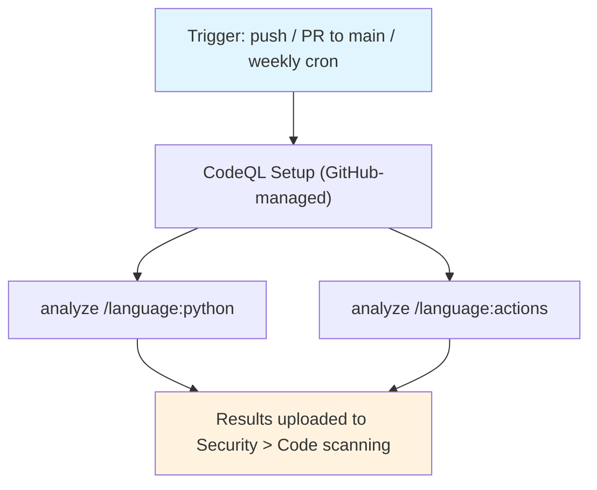

## Workflow Overview

**Purpose**: Run GitHub's CodeQL static analysis over the repository on every change to `main` and
on a weekly schedule, surfacing security findings in the repo's **Security > Code scanning** tab.
Adapted to a single maintainer: enabled through CodeQL **default setup** (GitHub-managed), so there
is no workflow file to keep in sync and no analysis config to maintain. Findings are advisory — they
do **not** gate merges at this spec version.

**Trigger Events**: Managed by GitHub default setup — push to the default branch (`main`), pull
requests targeting `main`, and a weekly cron. Not configurable per-event without switching to
advanced setup.

**Target Environments**: None. Analysis-only.

> **Status**: Enabled as **default setup** — there is deliberately **no** `.github/workflows/*.yml`
> for this. GitHub runs it as the dynamic workflow `dynamic/github-code-scanning/codeql`, visible
> under Actions as "CodeQL" but with no file in the tree. This document is the design contract for
> that configuration; it is kept in sync with the default-setup settings, not with a YAML file.

## Execution Flow Diagram



## Configuration (authoritative pointers)

The configuration is not in the repo; it lives in GitHub's code-scanning default-setup settings for
`davidouagne/datahub-yaml-source`. This section records the decisions and their rationale. Read the
live values with:

```bash
gh api repos/davidouagne/datahub-yaml-source/code-scanning/default-setup
```

| Setting | Value | Rationale |
|---------|-------|-----------|
| `state` | `configured` | Default setup enabled. |
| `languages` | `actions`, `javascript`, `javascript-typescript`, `python`, `typescript` (live-verified 2026-09-15; was `python`, `actions` only at v1.0) | `python` is the package source. `actions` is included on purpose: this repo's active work is hardening its own GitHub Actions workflows (`ci.yml`, `release.yml`, `dependency-review.yml`, `audit.yml`, `commit-policy.yml`), and CodeQL's Actions pack catches workflow script injection, over-broad `permissions`, and unpinned actions at zero extra cost. GitHub auto-detected both originally. The `javascript`/`javascript-typescript`/`typescript` entries are **not** new JS/TS source in this repo — confirmed via `git ls-files` matching zero `*.js`/`*.ts`/`*.jsx`/`*.tsx` files — this is GitHub's own default-setup language auto-detection/analyzer bundling for repos with GitHub Actions workflows, observed drifting in independently of any repo change (first documented in `docs/standards/ci-cd-security-quality.md` §3.3, issue #59). |
| `query_suite` | `default` | Not `extended`. The `default` suite is the high-signal / low-noise set; `extended` adds many lower-severity/experimental queries that are noise for a solo maintainer. Revisit only if the threat model changes. |
| `threat_model` | `remote` | GitHub default — treat only remote (network) input as tainted, not local files/env. Appropriate for a library that parses user-supplied YAML paths but is not a network service. |
| `schedule` | `weekly` | Set by default setup; picks up newly-published CodeQL queries without a code change. |
| `runner_type` | `standard` | GitHub-hosted runner; no self-hosted requirement. |

### Enablement (how this was turned on)

```bash
gh api --method PATCH repos/davidouagne/datahub-yaml-source/code-scanning/default-setup \
  -f state=configured -f query_suite=default \
  -f 'languages[]=python' -f 'languages[]=actions'
```

Requires repo **admin** and a token with the `repo` scope. The PATCH returns a `run_id` for the
initial "CodeQL Setup" run; enablement is complete when that run concludes `success` and
`gh api .../code-scanning/analyses` lists a CodeQL analysis for each language. This command is the
historical record of the *original* enablement (`languages: python, actions` only) — it was never
re-run to add `javascript`/`javascript-typescript`/`typescript`; those appeared on their own per the
`languages` row's note above. Re-running this exact command would revert to the two-language set; not
done, since the current five-language set is accurate to what GitHub's default setup already runs.

## Requirements Matrix

### Functional Requirements

| ID | Requirement | Priority | Acceptance Criteria |
|----|-------------|----------|---------------------|
| REQ-001 | CodeQL analysis runs on every change to `main`. | High | A push/PR to `main` triggers the `dynamic/github-code-scanning/codeql` workflow; a fresh analysis appears in `code-scanning/analyses`. |
| REQ-002 | Both Python and workflow files are analysed. | High | `code-scanning/analyses` shows categories `/language:python` and `/language:actions`. |
| REQ-003 | No CodeQL workflow YAML is committed. | High | No file under `.github/workflows/` mentions CodeQL; the repo uses default setup only. |
| REQ-004 | Configuration is documented and re-derivable. | Medium | This spec records every non-default choice; live values readable via the `default-setup` API. |
| REQ-005 | Findings are advisory (do not block merge) at this version. | High | CodeQL is **not** in `main`'s required status checks (see `spec/spec-process-cicd-ci.md` and wayfinder map issue #1, Notes). |
| REQ-006 | Weekly scheduled re-analysis stays enabled. | Low | `schedule` is `weekly` in the `default-setup` response. |

### Security Requirements

| ID | Requirement | Implementation Constraint |
|----|-------------|---------------------------|
| SEC-001 | No custom permissions or secrets to manage. | Default setup's dynamic workflow is GitHub-managed; it needs `security-events: write` to upload results, granted automatically. The repo defines no secret for it. |
| SEC-002 | Analysis config cannot be silently weakened by a PR. | Default setup is changed only through the repo settings / `code-scanning/default-setup` API by an admin, not by editing a tracked file in a PR. |

### Performance Requirements

| ID | Metric | Target | Measurement Method |
|----|-------|--------|---------------------|
| PERF-001 | Added wall-clock on a PR to `main` | Under ~5 minutes for this codebase size | CodeQL run duration in the Actions tab. |
| PERF-002 | Maintenance cost | Zero recurring | No YAML, no pinned CodeQL action versions, no matrix to maintain. |

## Known Baseline (at v1.0)

The first analysis reported **2 open alerts**, both from `/language:python`; `/language:actions`
reported **0**.

| Alert | Rule | Severity | Location | Assessment |
|-------|------|----------|----------|------------|
| #1, #2 | `py/incomplete-url-substring-sanitization` | `warning` (security-severity: high) | `src/datahub_yaml_source/yaml_source_config.py:32` (line number as of `docs/standards/ci-cd-security-quality.md`'s 2026-09-15 live check; was `:31` at v1.0, shifted by unrelated edits since) | `_https_clone_url` guards with `repo.startswith("github.com/")` / `repo.startswith("gitlab.com/")` on an already `strip()`/`rstrip("/")`-normalised string. `startswith` is an anchored prefix check, not the unanchored `in` / substring pattern this rule targets — these read as **false positives**. Left **open** and untriaged in the Security tab at this spec version; dismissing or fixing them is out of scope for the ticket that enabled CodeQL (wayfinder map issue #5) and is not tracked as required work. |

This baseline is recorded, not suppressed — consistent with how the mypy baseline is handled in
`spec/spec-process-cicd-ci.md`'s "Lint & Type-Check Configuration" section (formerly
`spec/spec-process-cicd-quality.md`, retired). There is no CodeQL config to add `paths-ignore` or query
filters (default setup does not support it); narrowing would require switching to advanced setup.

## Error Handling Strategy

| Error Type | Response | Recovery Action |
|------------|----------|------------------|
| CodeQL Setup run fails | Enablement incomplete; Security tab shows no CodeQL analysis | Re-run the setup run; confirm admin rights and `repo` token scope; check GitHub Actions is enabled for the repo. |
| A CodeQL analysis run fails on a PR | Reported in the Actions tab; **not** a required check, so merge is not blocked | Inspect the run log; transient infra failures resolve on re-run. |
| New CodeQL alert appears | Surfaced in Security > Code scanning; no merge gate at this version | Triage in the Security tab: fix, or dismiss with a reason. |

## Quality Gates

| Gate | Criteria | Bypass Conditions |
|------|----------|---------------------|
| Code scanning | CodeQL analysis completes and results upload to the Security tab | Never a merge gate at this spec version. Promoting CodeQL to a required check requires a spec update **and** a branch-protection change on `main` (see `spec/spec-process-cicd-ci.md`, and wayfinder map issue #1 "Not yet specified"). |

## Integration Points

### Dependent Workflows

| Workflow | Relationship | Trigger Mechanism |
|----------|---------------|---------------------|
| Branch protection on `main` | **Not** coupled at this version — CodeQL is intentionally excluded from required status checks (map issue #1, Notes). `main`'s ruleset requires `CI status`, `dependency-review`, `dco`, `commitlint` and `pr-title` (`spec/spec-process-cicd-ci.md`, `spec/spec-process-cicd-dependency-review.md`, `spec/spec-process-cicd-commit-policy.md`). | n/a |
| `spec/spec-process-cicd-ci.md` (CI) | Sibling; disjoint responsibility. CI owns test/coverage/lint/format/types (the latter two folded in from the now-retired `spec/spec-process-cicd-quality.md` as of `ci.md` v1.12), this owns SAST. CI gates `main`; this is advisory. | Same trigger events (push/PR to `main`) |
| `spec/spec-process-cicd-dependency-review.md` | Also gates `main` (required as of v1.2); disjoint responsibility (SCA license/vuln gate, not SAST). | Same trigger events (PR to `main`) |

## Validation Criteria

- **VLD-001**: `gh api repos/davidouagne/datahub-yaml-source/code-scanning/default-setup` returns
  `state: configured`, `query_suite: default`, `languages` containing `python` and `actions` (at least
  these two; live-verified 2026-09-15 it also includes `javascript`/`javascript-typescript`/`typescript`
  — see the `languages` configuration row above for why that's not a concern).
- **VLD-002**: `gh api repos/davidouagne/datahub-yaml-source/code-scanning/analyses` lists a CodeQL
  analysis for both `/language:python` and `/language:actions`.
- **VLD-003**: The repo's **Security > Code scanning** page shows CodeQL as an active tool.
- **VLD-004**: No file under `.github/workflows/` references CodeQL (default setup, not advanced).
- **VLD-005**: `main`'s branch-protection required checks do **not** include a CodeQL check.

## Change Management

### Update Process

1. **Specification Update**: Modify this document first.
2. **Configuration change**: Apply via the repo's Code security settings UI or the
   `code-scanning/default-setup` API (admin only).
3. **Verification**: Re-confirm the Validation Criteria.
4. **Deployment**: Commit the spec change; the configuration change takes effect immediately on save
   (no merge required, since there is no workflow file).

Switching from default to **advanced setup** (custom `codeql.yml`, `paths-ignore`, custom query
packs), enabling the `extended` query suite, or making CodeQL a **required** check on `main` are each
breaking changes: update this spec, and for the required-check case also update `main` branch
protection.

### Version History

| Version | Date | Changes | Author |
|---------|------|---------|--------|
| 1.0 | 2026-09-07 | Initial specification. CodeQL enabled via **default setup** (`state=configured`, `query_suite=default`, `languages=python,actions`, `threat_model=remote`, weekly schedule). No workflow file committed. Advisory only — not a required check on `main`. Recorded baseline: 2 open `py/incomplete-url-substring-sanitization` alerts (both likely false positives on `startswith` prefix guards in `yaml_source_config.py`), 0 from Actions analysis. | David Ouagne |
| 1.1 | 2026-09-15 | Live-state refresh (no config change): `languages` now returns `actions, javascript, javascript-typescript, python, typescript` (was `python, actions`) — GitHub's own default-setup auto-detection, not new JS/TS source in this repo (confirmed via `git ls-files`, first caught in `docs/standards/ci-cd-security-quality.md` §3.3, issue #59). Also: the open-alert location's line number corrected `:31` → `:32` (unrelated edits shifted it); every `spec/spec-process-cicd-quality.md` reference replaced following that spec's retirement into `spec/spec-process-cicd-ci.md` v1.12; `main`'s required-checks references corrected from the stale `["CI status", "ruff"]` to the current `["CI status", "dependency-review"]`. | David Ouagne |
| 1.2 | 2026-09-20 | Documentation-accuracy correction, no behavior change: Integration Points now lists the five checks required by `main`'s ruleset (which replaced classic branch protection; `spec/spec-process-cicd-ci.md` v1.13). CodeQL remains advisory. | David Ouagne |

## Related Specifications

- `spec/spec-process-cicd-ci.md` — CI (install, test, coverage, lint, typecheck since v1.12); a required
  check on `main`.
- `spec/spec-process-cicd-dependency-review.md` — also a required check on `main` as of v1.2. This spec
  is their SAST sibling; unlike them it gates nothing yet.
- `spec/spec-process-cicd-release.md` — Release pipeline; unrelated trigger surface.
