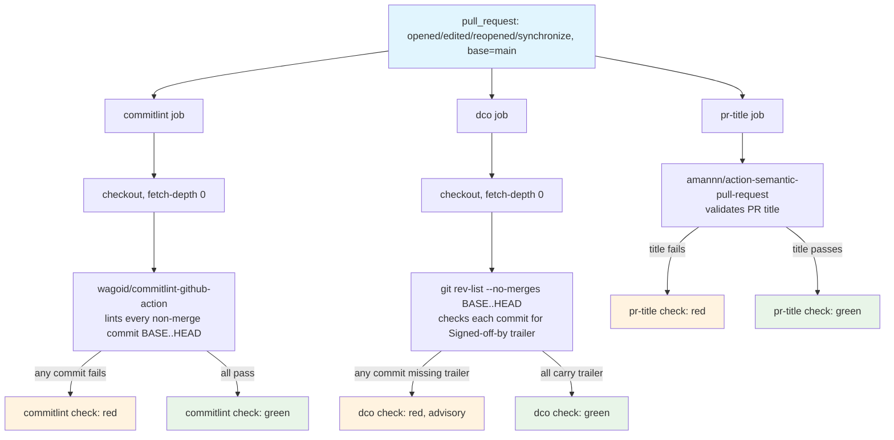

## Workflow Overview

**Purpose**: Keep commit history and PR titles well-formed Conventional Commits before they land on
`main`, so they can safely become load-bearing for automated tooling later (release-please's
version/changelog computation, per issue #48's user story 6) rather than being a manual-discipline-only
convention that silently drifts. As of v1.1, also checks every commit carries a DCO `Signed-off-by`
trailer (advisory) — see "Why DCO was added" below.

**Trigger Events**: `pull_request` (`opened`, `edited`, `reopened`, `synchronize`), scoped to `main`.

**Target Environments**: None. Lints commit messages and a PR title only; never deploys anything.

> **Status**: Implemented at `.github/workflows/commit-policy.yml` and `commitlint.config.mjs`. This
> document is the design contract those files must satisfy; changes to any of the three should keep the
> others in sync, per Change Management below.

## Why DCO was added (v1.1)

At v1.0, DCO sign-off enforcement was an explicit, documented non-goal (former REQ-005: "DCO sign-off is
not enforced... deliberate exclusion, per #52's acceptance criteria"), because issue #48's scoping
explicitly carved it out as a decision to leave absent, matching neither repo forcing the other's
posture on this one axis. That decision was reversed by the maintainer after directly comparing this
repo's checks against the sibling repo `datahub-healthdcat-ap-exporter`, which runs a `dco` job
(`ADR-0002`-driven there) — advisory, not a required status check. This document's v1.1 adds the same
`dco` job here, also advisory, matching the sibling's actual (not aspirational) posture rather than
re-litigating the original #52 scoping decision from scratch. Unlike `commitlint`/`pr-title`, which stay
narrower than the sibling's own config by deliberate, still-standing choice (REQ-007/REQ-008), `dco` is
ported as-is: a straightforward per-commit `Signed-off-by:` trailer check has no repo-specific nuance to
diverge on the way commit-type/header-length policy does.

## Execution Flow Diagram

## Jobs & Dependencies

| Job Name | Purpose | Dependencies | Execution Context |
|----------|---------|--------------|--------------------|
| `commitlint` | Lint every non-merge commit between the PR's base and head against `commitlint.config.mjs`. Runs on every trigger type, including `edited` — see REQ-010 for why an earlier draft's skip-on-`edited` optimization was reverted. | None | Linux runner, `timeout-minutes: 10` |
| `pr-title` | Validate the PR title itself is a well-formed Conventional Commit / semantic PR title. Runs on every trigger type, including `edited`, since that's exactly when the title can change. | None | Linux runner (no checkout — reads the event payload), `timeout-minutes: 10` |
| `dco` | Verify every non-merge commit between the PR's base and head carries a `Signed-off-by: Name <email>` trailer. Advisory only (v1.1) — see "Why DCO was added". | None | Linux runner, `timeout-minutes: 10` |

## Requirements Matrix

### Functional Requirements

| ID | Requirement | Priority | Acceptance Criteria |
|----|-------------|----------|---------------------|
| REQ-001 | Every non-merge commit in a PR is checked against Conventional Commits. | High | The `commitlint` job runs `wagoid/commitlint-github-action` with `fetch-depth: 0`, against `commitlint.config.mjs` (`extends: @commitlint/config-conventional`). |
| REQ-002 | Merge commits inside a PR do not themselves need to be Conventional Commits. | Medium | Not special-cased in this workflow — relies on commitlint's own default-ignores, which exempt messages shaped like `Merge pull request #N ...` / `Merge branch '...'` (verified locally: `echo "Merge pull request #62 from davidouagne/..." \| commitlint` passes). |
| REQ-003 | The PR title is checked against Conventional Commits / semantic PR title rules. | High | The `pr-title` job runs `amannn/action-semantic-pull-request`, which validates `type(scope): subject` structure against the Conventional Commit type list, with `requireScope: false`. |
| REQ-004 | A malformed commit message or PR title fails its respective check. | High | Verified per Validation Criteria below — a synthetic malformed commit/title fails; fixing it and re-running passes. |
| REQ-005 | Every non-merge commit in a PR carries a DCO `Signed-off-by` trailer. | Medium (advisory) | The `dco` job runs `git rev-list --no-merges BASE..HEAD` and greps each commit's message for `^Signed-off-by: .+ <.+>$`, failing if any commit lacks one. **Reversed from v1.0's explicit non-goal** — see "Why DCO was added" above. Not a required status check (matches the sibling repo's own posture for its `dco` job). |
| REQ-006 | Dependabot's own commits and PR titles keep passing. | High | Verified against this repo's real merged Dependabot commit (PR #61): fails strict `@commitlint/config-conventional` on `subject-case` (Dependabot capitalizes: "Bump codecov/codecov-action..."), passes with this config's `subject-case: [0]`. Dependabot PR titles observed in this repo (`ci: Bump ...`, `build(deps-dev): Update ...`) already match `type(scope): subject`. |

### Non-Functional / Consistency Requirements

| ID | Requirement | Rationale |
|----|-------------|-----------|
| REQ-007 | The allowed commit `type` set is not narrowed below what this repo already uses. | This repo's own history (54 non-merge commits at time of writing) uses `feat`, `fix`, `docs`, `build`, `ci`, `refactor`, `style`, `test` — all standard Conventional Commit types. `commitlint.config.mjs` does **not** override `type-enum`, keeping `@commitlint/config-conventional`'s full standard list (adds `chore`, `perf`, `revert`, none of which conflict). The sibling repo's own commit-policy config narrows this to 6 types (`feat, fix, test, docs, chore, build`); that list was **not** ported here because it excludes `ci`/`refactor`/`style`, which this repo's actual workflow-file and cleanup commits (including this very change) depend on. |
| REQ-008 | `header-max-length` is not tightened below `@commitlint/config-conventional`'s default. | The longest header in this repo's own history is exactly 100 characters (the default cap) — no evidence a tighter limit matches actual practice, and no such requirement in #52. Left at the default rather than the sibling's 72. |
| REQ-009 | All three jobs fail fast rather than occupying a runner indefinitely. | `timeout-minutes: 10` on every job, matching every job in `ci.yml`/`release.yml` (10-15 minutes) — a hang in a third-party Action (e.g. a GitHub API stall) can't silently burn CI minutes up to GitHub's 360-minute default; the `dco` job's own plain `git`/`grep` loop has no third-party Action to hang on at all. |
| REQ-010 | `commitlint` runs unconditionally on every trigger type, including `edited` — no skip-on-`edited` optimization. | **Rejected design**: an earlier draft skipped `commitlint` on `edited` (reasoning: a title/description-only edit carries no new commits, so re-linting is redundant). Two problems surfaced in code review: (1) GitHub's `edited` action also fires on a PR **base-branch retarget** (distinguishable only via `github.event.changes.base`, which the guard didn't check), so a PR retargeted onto `main` from another branch could skip commit-linting entirely; (2) the guard combined with a shared `concurrency.group` meant an `edited` event landing while `commitlint` was still running could cancel that run outright, and the replacement (`edited`-triggered) run would then skip `commitlint` via the same guard, leaving the check stuck "cancelled" until the next push. **Actual design**: always run `commitlint`, accepting the minor CI-minutes cost of occasionally re-linting unchanged commits on a title tweak — simpler and correct beats a small efficiency gain with two real edge-case bugs attached. |

### Security Requirements

| ID | Requirement | Implementation Constraint |
|----|-------------|----------------------------|
| SEC-001 | Every job holds the minimum token scope it needs. | Top-level `permissions: {}`; `commitlint` grants itself `contents: read` (checkout) + `pull-requests: read` (defensive — the action's own docs don't document exactly what its token is used for); `pr-title` grants only `pull-requests: read`; `dco` grants only `contents: read` (checkout). None grants `write` of any kind. |
| SEC-002 | No job runs with base-repo secrets against untrusted fork-PR content. | Plain `pull_request` (not `pull_request_target`) throughout — every PR in this repo is a same-repo branch (maintainer's own, or Dependabot's), never a fork, so there is no untrusted-head-with-base-repo-token concern to manage. Same posture as `spec/spec-process-cicd-dependabot-auto-merge.md`'s SEC-002. |

## Error Handling Strategy

| Situation | Response | Recovery Action |
|-----------|----------|-------------------|
| A commit message doesn't follow Conventional Commits | `commitlint` job fails, printing the specific rule violated | Author amends/rewords the offending commit (`git commit --amend` / interactive rebase) and force-pushes the PR branch; the check re-runs on `synchronize`. |
| The PR title doesn't follow Conventional Commits | `pr-title` job fails, printing the specific rule violated | Author edits the PR title in the GitHub UI; the check re-runs on `edited` (no new commit needed). |
| A grouped Dependabot PR's auto-generated commit body/footer has long non-URL lines | `body-max-line-length`/`footer-max-line-length` are disabled in `commitlint.config.mjs`, so this alone cannot fail the check | Not an error case by design — see REQ-006/REQ-008. If a future Dependabot format change introduces a genuinely non-conventional *type/subject*, that would still (correctly) fail. |
| A commit lacks a `Signed-off-by` trailer | `dco` job fails, naming the offending SHA (advisory — does not block merge) | Author re-commits with `git commit -s` (or amends: `git commit -s --amend`, or an interactive rebase adding `-s` to each commit), force-pushes; the check re-runs on `synchronize`. Dependabot's own commits do **not** carry this trailer and will always fail `dco` — accepted, since the check is advisory and Dependabot's commit content itself is trusted (generated by GitHub's own service). |

## Quality Gates

| Gate | Criteria | Bypass Conditions |
|------|----------|----------------------|
| `commitlint` | Every non-merge commit in the PR passes `commitlint.config.mjs` | None built into the workflow. **Not currently a required status check on `main`** — deliberate initial-rollout decision, not an oversight (mirrors `mypy`'s own advisory-then-required history, `spec/spec-process-cicd-ci.md`). |
| `pr-title` | The PR title passes `amannn/action-semantic-pull-request` | Same as above — advisory, not yet a required status check. |
| `dco` | Every non-merge commit in the PR carries a `Signed-off-by` trailer | Advisory only, by design — matches the sibling repo's own `dco` job, which is likewise not a required status check there. Not planned for promotion (unlike `mypy`'s history): Dependabot's own commits would always fail it. |

## Integration Points

| Component | Relationship | Mechanism |
|-----------|---------------|--------------|
| `commitlint.config.mjs` (repo root) | Config the `commitlint` job's action reads | `configFile: commitlint.config.mjs` input |
| `spec/spec-process-cicd-dependabot.md` / `spec/spec-process-cicd-dependabot-auto-merge.md` | Dependabot PRs are the highest-volume, most format-constrained input to this workflow; also always fail `dco` (Error Handling Strategy) but this never blocks Dependabot auto-merge since `dco` isn't a required check | REQ-006 verifies `commitlint` compatibility directly against a real merged Dependabot commit |
| `spec/spec-process-cicd-ci.md` | Precedent for the advisory-then-required promotion pattern this spec's Quality Gates section follows (`mypy`'s own history, formerly `spec/spec-process-cicd-quality.md`, retired into this document) | `mypy`'s own version history |
| `wagoid/commitlint-github-action@v6` / `amannn/action-semantic-pull-request@v6` (third-party Actions) | Implement the `commitlint`/`pr-title` checks | `uses:` steps, no separate `npm install`/`package.json` needed — both actions bundle their own toolchain |
| `datahub-healthdcat-ap-exporter`'s own `ADR-0002` (DCO, a different repo/document — not this repo's `docs/adr/0002-migrate-to-uv.md`, which is unrelated) | `dco`'s design (check shape, advisory posture) is ported from the sibling repo's own job, not independently designed here | Referenced in "Why DCO was added" above |

## Validation Criteria

- **VLD-001**: Open a throwaway PR with a commit whose message doesn't start with a valid Conventional
  Commit `type:`/`type(scope):` prefix (e.g. `add a thing`) and confirm the `commitlint` check fails.
  Amend the commit to a valid message (e.g. `fix: add a thing`) and confirm the check turns green on
  the next push.
- **VLD-002**: Open a throwaway PR with a non-conventional title (e.g. `Add a thing`) and confirm the
  `pr-title` check fails. Edit the title to a valid one (e.g. `fix: add a thing`) and confirm the check
  turns green without needing a new commit.
- **VLD-003**: Confirm a merge commit's own message (e.g. `Merge pull request #N from ...`) does not
  itself need to satisfy Conventional Commits — exercised via the local reproduction in REQ-002, or by
  observing an actual PR merge commit never gets linted as a "non-merge" commit.
- **VLD-004**: Confirm this repo's own real Dependabot commit history keeps passing: the exact commit
  message of PR #61 (`ci: Bump codecov/codecov-action from 5 to 7` + its auto-generated body/footer)
  passes `commitlint --config commitlint.config.mjs`, and fails plain
  `@commitlint/config-conventional` on `subject-case` alone — proving the relaxation in
  `commitlint.config.mjs` is load-bearing, not decorative.
- **VLD-005**: Confirm no job requires `contents: write`/`pull-requests: write` — read `git blame`
  on `.github/workflows/commit-policy.yml`'s `permissions:` blocks against SEC-001.
- **VLD-006**: Open a throwaway PR with a commit that has no `Signed-off-by` trailer and confirm the
  `dco` check fails, naming the offending SHA. Amend with `git commit -s --amend` and confirm the check
  turns green on the next push.
- **VLD-007**: Confirm a real Dependabot-authored PR's commits (which never carry `Signed-off-by`) show
  `dco` as failed but do not block `gh pr merge --auto` — `dco` is absent from `main`'s required status
  checks.

## Change Management

### Update Process

1. **Specification Update**: Modify this document first.
2. **Implementation**: Apply to `.github/workflows/commit-policy.yml` and/or `commitlint.config.mjs`.
3. **Verification**: Confirm the Validation Criteria against a real or throwaway PR.
4. **Deployment**: Merge; the workflow applies to the next PR opened or synchronized against `main`.

Widening/narrowing the allowed commit `type` set, changing `requireScope`, promoting `dco` to a required
status check (would break Dependabot auto-merge — see Error Handling Strategy), or promoting
`commitlint`/`pr-title` to required status checks on `main` are each material changes: update this
spec first.

### Version History

| Version | Date | Changes | Author |
|---------|------|---------|--------|
| 1.0 | 2026-09-15 | Initial specification. `.github/workflows/commit-policy.yml` + `commitlint.config.mjs` added (issue #52, part of the `#48` standardization epic): `commitlint` job (`wagoid/commitlint-github-action@v6`) lints every non-merge PR commit; `pr-title` job (`amannn/action-semantic-pull-request@v6`) validates the PR title. Deliberately narrower than the sibling repo's `commit-policy.yml`: no `dco` job (DCO explicitly out of scope per #52), no custom `type-enum` restriction (the sibling's 6-type list would break this repo's existing `ci`/`refactor`/`style` commit usage), default `header-max-length` (100, not 72). Both `subject-case` and `body-max-line-length`/`footer-max-line-length` relaxed, validated directly against this repo's real merged Dependabot commit (PR #61) rather than assumed from the sibling's rationale. Neither check added to `main`'s required status checks in this change — advisory rollout, mirroring `mypy`'s own history. Three code-review passes (all still pre-merge) refined this before it ever shipped: (1) added `timeout-minutes: 10` to both jobs, matching `ci.yml`/`quality.yml`/`release.yml`; (2) a `commitlint`-skip-on-`edited` optimization was added to avoid re-linting unchanged commits on a title tweak, then (3) reverted after two further reviews found it could skip commit-linting entirely on a PR base-branch retarget, and separately race with a shared `concurrency.group` to leave the check stuck "cancelled" — REQ-010 records the rejected design and why. Also corrected an inaccurate `CONTRIBUTING.md` claim that `commitlint.config.mjs` itself enumerates the accepted commit types (it only does `extends: [...]`; the list lives in `@commitlint/config-conventional`). | David Ouagne |
| 1.1 | 2026-09-15 | **Added `dco` job (advisory), reversing v1.0's explicit DCO non-goal** — see "Why DCO was added" above: prompted by the maintainer comparing this repo's checks against the sibling repo directly, which runs `dco` (advisory, `ADR-0002`-driven there). Ported as-is (no repo-specific divergence, unlike `commitlint`'s narrower `type-enum`/`header-max-length`): checks every non-merge commit between base/head for a `^Signed-off-by: .+ <.+>$` trailer via plain `git rev-list --no-merges` + `grep`, no third-party Action. Not added to `main`'s required status checks and not planned to be — Dependabot's own commits never carry this trailer and would permanently fail it, documented as an accepted, expected state in the new Error Handling Strategy row. `CONTRIBUTING.md` updated with a `git commit -s` recommendation. Former REQ-005 ("DCO sign-off is not enforced") replaced with a new REQ-005 describing the check; REQ-009's job-count wording, SEC-001/SEC-002, Quality Gates, Integration Points, and Change Management's "adding DCO enforcement" material-change note all updated to match the new state. | David Ouagne |

## Related Specifications

- `spec/spec-process-cicd-dependabot.md` — the highest-volume PR producer this workflow lints; REQ-006
  documents the compatibility check.
- `spec/spec-process-cicd-dependabot-auto-merge.md` — SEC-002's `pull_request`-not-`pull_request_target`
  reasoning is shared with this spec's SEC-002.
- `spec/spec-process-cicd-ci.md` — precedent for the advisory-then-required promotion pattern this
  spec's Quality Gates section follows (`mypy`'s history, now documented there — the former
  `spec/spec-process-cicd-quality.md` is retired). Also `main`'s branch protection, where
  `commitlint`/`pr-title` would be
  added if/when promoted to required (not done in this change).
