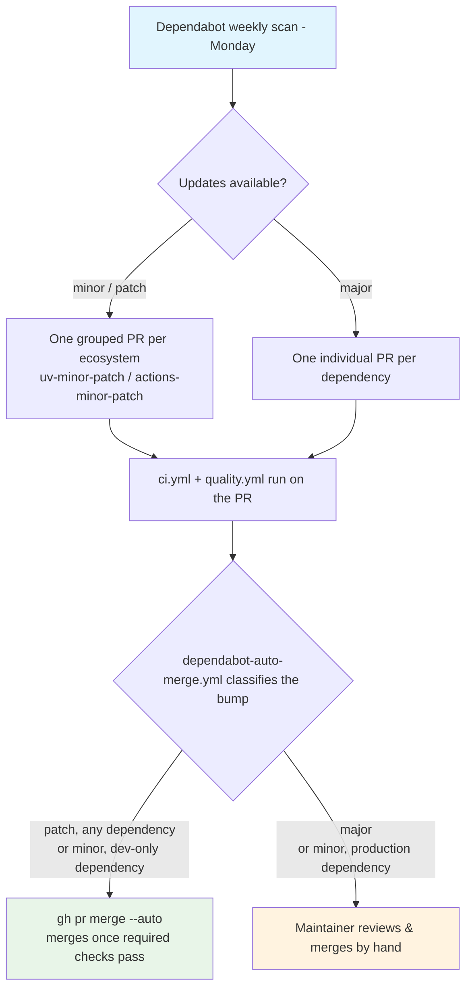

## Process Overview

**Purpose**: Keep the project's Python dependencies and GitHub Actions pins current with low manual
overhead. Dependabot opens the PRs; low-risk ones (patch-level, any dependency; minor-level, dev-only
dependencies) auto-merge once required checks are green (`spec/spec-process-cicd-dependabot-auto-merge.md`,
ADR-0003); everything else — majors, and minor bumps to production dependencies — still waits for a
human to review and merge it by hand.

**Trigger**: Dependabot's own weekly schedule (Mondays). Not a GitHub Actions workflow — this is the
native Dependabot service, configured by `.github/dependabot.yml`. There is no file under
`.github/workflows/` for it, so this document is the design contract for `.github/dependabot.yml`
directly (same arrangement as `spec/spec-process-cicd-codeql.md`).

**Target Environments**: None. Produces pull requests only.

> **Status**: Implemented at `.github/dependabot.yml`. Changes to either that file or this document
> should keep the other in sync, per Change Management below.

## Execution Flow Diagram

## Configuration (authoritative pointer: `.github/dependabot.yml`)

This section records the decisions and their rationale; the file is the source of truth.

| Setting | Value | Rationale |
|---------|-------|-----------|
| `version` | `2` | Current Dependabot config schema. |
| Ecosystems | `uv` (`/`) and `github-actions` (`/`) | `uv` covers `pyproject.toml` + `uv.lock` at the repo root (project dependencies, optional-dependencies, and the `dev` dependency group). `github-actions` covers the `uses:` pins in `.github/workflows/*.yml`. |
| `schedule.interval` | `weekly` | One batch a week is enough churn for a solo maintainer; `daily` would just lengthen the manual queue. |
| `schedule.day` | `monday` | Predictable — the maintainer knows when to expect the PRs. |
| `groups` (per ecosystem) | `uv-minor-patch`, `actions-minor-patch`: `patterns: ["*"]`, `update-types: ["minor", "patch"]` | Collapse all non-breaking bumps into **one PR per ecosystem** to keep the manual merge queue short. Major updates are deliberately left **out** of the groups, so each breaking bump lands as its own PR and is reviewed in isolation. |
| `open-pull-requests-limit` | `5` per ecosystem | With grouping, steady state is ~1 grouped PR + a few majors; 5 is headroom without letting the queue balloon. |
| `labels` | `["dependencies"]` | Feeds the `⬆️ Dependencies` category in `.github/release.yml` (auto-generated release notes). The `dependencies` label is created in the repo (colour `#0366d6`), not left to Dependabot's implicit creation. |
| `commit-message.prefix` | `build` (uv), `ci` (github-actions); `include: scope` on uv | Matches the repo's conventional-commit history (`build:` for packaging/deps, `ci:` for workflow/tooling). |
| `ignore` | **none** | See below. |
| Auto-merge | Patch-level bumps (any dependency) and minor-level bumps to dev-only dependencies, via `.github/workflows/dependabot-auto-merge.yml` | ADR-0003 / issue #51, superseding the original no-auto-merge decision on wayfinder map issue #1. Majors and minor bumps to production dependencies still require manual review; see `spec/spec-process-cicd-dependabot-auto-merge.md` for the workflow's own contract. |

### No `ignore` for `acryl-datahub` majors

`pyproject.toml` pins `acryl-datahub>=1.7.0.9,<1.8` on purpose — the `1.7.0.x` series takes undeprecated
breaks in the experimental `datahub.sdk.*` surface this connector builds on (documented inline in
`pyproject.toml`). Dependabot will open a PR proposing to lift that ceiling. That PR is **wanted**: the
by-hand review it gets (like every dependency PR) is the gate, and lifting the cap is tracked as its
own migration task elsewhere. An `ignore` rule would only suppress a signal the maintainer wants
queued.

### What Dependabot will not touch

`release.yml` pins `pypa/gh-action-pypi-publish@release/v1` — a **branch** ref. Dependabot's
`github-actions` updater only bumps tag and SHA pins, not branch refs, so this pin is maintained by
hand (it is the action's publisher-recommended moving pointer).

## Requirements Matrix

### Functional Requirements

| ID | Requirement | Priority | Acceptance Criteria |
|----|-------------|----------|---------------------|
| REQ-001 | Python deps are monitored. | High | A `uv` update block with `directory: "/"` exists; Dependabot's "Last checked" for uv is current on the repo's Insights > Dependency graph > Dependabot tab. |
| REQ-002 | Workflow action pins are monitored. | High | A `github-actions` update block with `directory: "/"` exists and is shown as active. |
| REQ-003 | Non-breaking bumps do not flood the queue. | High | Minor/patch updates for an ecosystem arrive as a single grouped PR, not one per package. |
| REQ-004 | Breaking bumps are individually reviewable. | Medium | A major-version update appears as its own PR, outside the group. |
| REQ-005 | Only low-risk dependency changes merge unreviewed. | High | Patch-level bumps (any dependency) and minor-level bumps to dev-only dependencies auto-merge once required checks pass (`spec/spec-process-cicd-dependabot-auto-merge.md`); majors and minor bumps to production dependencies still require a human to merge. |
| REQ-006 | Dependabot PRs are categorised in release notes. | Low | Dependabot PRs carry the `dependencies` label; `.github/release.yml` routes it to `⬆️ Dependencies`. |

### Security Requirements

| ID | Requirement | Implementation Constraint |
|----|-------------|---------------------------|
| SEC-001 | Dependabot security updates stay enabled. | Repo setting "Dependabot security updates" is on; a `dependabot.yml` presence does not disable it. Security PRs bypass the weekly schedule by design. |
| SEC-002 | No secret is exposed to Dependabot. | The config declares no `registries`; all indexes are public (PyPI, GitHub). |

## Error Handling Strategy

| Situation | Response | Recovery Action |
|-----------|----------|------------------|
| Grouped PR's CI fails (`ci.yml` / `quality.yml`) | PR stays open, red | Inspect which member bump broke it; comment `@dependabot recreate` after splitting, or bump the offending package's constraint by hand and close the PR. |
| A major bump PR is unwanted right now | Leave open or close | Closing tells Dependabot to stop re-opening that exact version; it will re-propose on the next major. Add a scoped `ignore` only if a bump must be suppressed long-term (spec update required). |
| `dependabot.yml` is itself malformed | Dependabot posts an error on the repo's Dependabot tab; no PRs are opened | Fix per the error; validate against GitHub's `dependabot.yml` schema. |

## Quality Gates

| Gate | Criteria | Bypass Conditions |
|------|----------|---------------------|
| CI on Dependabot PRs | `ci.yml` (`CI status`) and `quality.yml` (`ruff`) pass before merge | None — Dependabot PRs go through the same required checks as any PR to `main`, including the ones auto-merged; `gh pr merge --auto` queues the merge, it does not bypass branch protection. |
| Human review | Every non-low-risk Dependabot PR is read and merged by a maintainer | Patch-level bumps (any dependency) and minor-level bumps to dev-only dependencies skip this gate — see `spec/spec-process-cicd-dependabot-auto-merge.md` (ADR-0003 / issue #51). |

## Integration Points

| Component | Relationship | Mechanism |
|-----------|---------------|-----------|
| `spec/spec-process-cicd-ci.md` (CI) | Gates Dependabot PRs | `ci.yml` triggers on `pull_request` to `main` |
| `spec/spec-process-cicd-quality.md` (Quality) | Gates Dependabot PRs | `quality.yml` triggers on `pull_request` to `main` |
| `.github/release.yml` | Consumes the `dependencies` label for note categorisation | `gh release create --generate-notes` in `release.yml` |
| Repo "Dependabot security updates" setting | Complementary — this file governs scheduled *version* updates; the setting governs on-demand *security* updates | GitHub repo setting, not this file |
| `spec/spec-process-cicd-dependabot-auto-merge.md` (`.github/workflows/dependabot-auto-merge.yml`) | Downstream — classifies each Dependabot PR opened under this config and auto-merges the low-risk ones | Triggers on `pull_request`, filtered to `github.actor == 'dependabot[bot]'` |

## Validation Criteria

- **VLD-001**: `.github/dependabot.yml` parses (no error banner on the repo's Dependabot tab) and lists
  both a `uv` and a `github-actions` update block, each `directory: "/"`, `interval: weekly`.
- **VLD-002**: The first weekly run (or a manual "Check for updates") produces at most one grouped PR
  per ecosystem for outstanding minor/patch bumps.
- **VLD-003**: Every Dependabot PR carries the `dependencies` label and runs `CI status` + `ruff`.
- **VLD-004**: The only auto-merge mechanism in the repo is `.github/workflows/dependabot-auto-merge.yml`,
  and it enables auto-merge exclusively for patch-level bumps (any dependency) and minor-level bumps to
  dev-only dependencies — see `spec/spec-process-cicd-dependabot-auto-merge.md` Validation Criteria for
  the classification's own tests.
- **VLD-005**: The `dependencies` label exists in the repo independently of Dependabot having run.

## Change Management

### Update Process

1. **Specification Update**: Modify this document first.
2. **Implementation**: Apply to `.github/dependabot.yml`.
3. **Verification**: Confirm the Validation Criteria (use the repo's "Check for updates" button to
   force a run rather than waiting for Monday).
4. **Deployment**: Merge; Dependabot picks up the new config on its next run.

Adding a private `registries` block or adding an `ignore` rule are each material changes: update this
spec. Changing the auto-merge *policy* (which bump types qualify) is a material change too, but lives
in `spec/spec-process-cicd-dependabot-auto-merge.md` — update that spec first, this one only if the
Configuration table's summary of the policy goes stale.

### Version History

| Version | Date | Changes | Author |
|---------|------|---------|--------|
| 1.0 | 2026-09-07 | Initial specification. `.github/dependabot.yml` added: `pip` + `github-actions`, weekly (Monday), minor/patch grouped one-PR-per-ecosystem, majors individual, limit 5, `dependencies` label, `build`/`ci` commit prefixes. No `ignore` (acryl-datahub cap left visible), no auto-merge. `dependencies` label created (`#0366d6`). Pointer added to `spec/spec-process-cicd-ci.md` Dependent Workflows. | David Ouagne |
| 1.1 | 2026-09-14 | Migrated from `pip`/`setup.py` to `uv`/`pyproject.toml` (`datahub-yaml-source`#49): the Python ecosystem block's `package-ecosystem` changed from `pip` to `uv` (now tracks `pyproject.toml` + `uv.lock`), and its group renamed `pip-minor-patch` → `uv-minor-patch`. Corrected a stale reference in the "No `ignore`" note: the actual `acryl-datahub` cap is `<1.8`, not the `<1.7.0.5` this document had drifted to. No change to schedule, grouping philosophy, labels, or the no-auto-merge decision. | David Ouagne |
| 1.2 | 2026-09-15 | Superseded the map-issue-#1 no-auto-merge decision with ADR-0003 (issue #51, part of the `#48` standardization epic): added `.github/workflows/dependabot-auto-merge.yml`, which auto-merges patch-level bumps (any dependency) and minor-level bumps to dev-only dependencies once required checks pass. Majors and minor bumps to production dependencies are unaffected — still manual. Its own contract now lives in the new `spec/spec-process-cicd-dependabot-auto-merge.md`; this document's Configuration/REQ-005/Quality-Gates/VLD-004 sections were updated to summarize rather than assert "no auto-merge". `.github/dependabot.yml`'s header comment updated to match. No change to schedule, grouping, ecosystems, or labels. | David Ouagne |

## Related Specifications

- `spec/spec-process-cicd-dependabot-auto-merge.md` — the auto-merge workflow's own contract: bump
  classification, `gh pr merge --auto`, ADR-0003.
- `spec/spec-process-cicd-ci.md` — CI; gates every Dependabot PR (`CI status` required on `main`).
- `spec/spec-process-cicd-quality.md` — Ruff/mypy; `ruff` required on `main`, also gates Dependabot PRs.
- `spec/spec-process-cicd-release.md` — consumes the `dependencies` label via `.github/release.yml`.
- `spec/spec-process-cicd-codeql.md` — the other GitHub-native (non-workflow-file) process in this repo.
