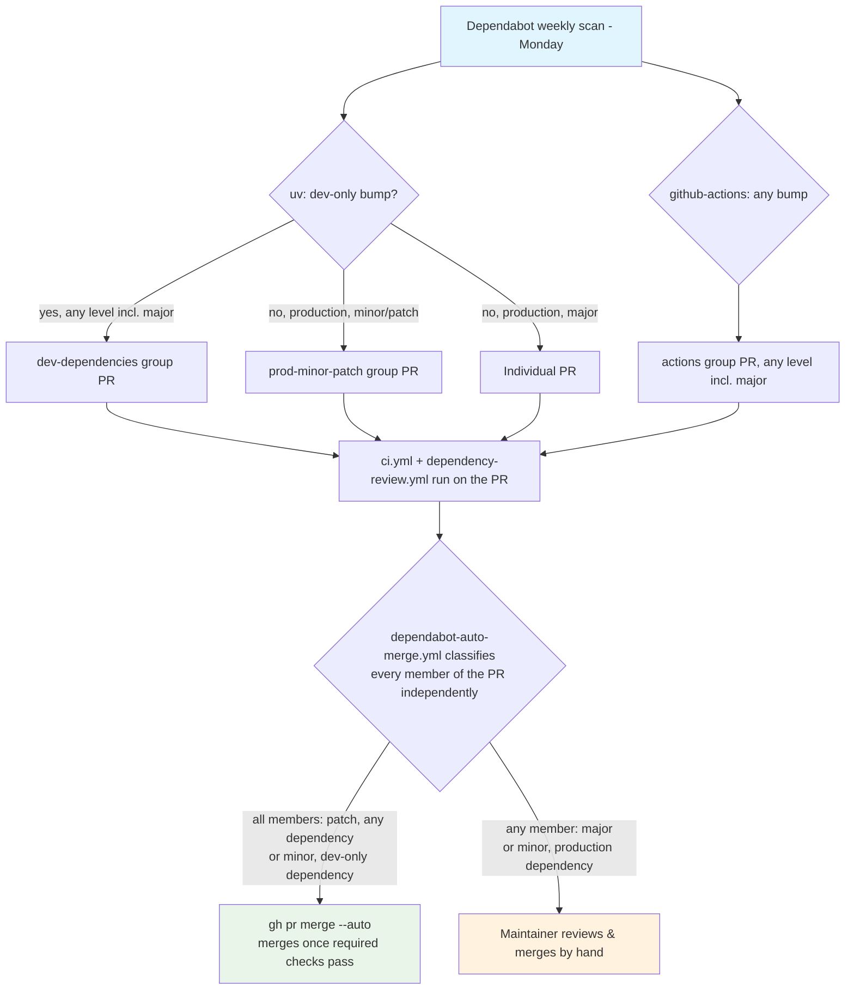

## Process Overview

**Purpose**: Keep the project's Python dependencies and GitHub Actions pins current with low manual
overhead. Dependabot opens the PRs; low-risk ones (patch-level, any dependency; minor-level, dev-only
dependencies) auto-merge once required checks are green (`spec/spec-process-cicd-dependabot-auto-merge.md`,
ADR-0003); everything else — majors, and minor bumps to production dependencies — still waits for a
human to review and merge it by hand.

**Trigger**: Dependabot's own weekly schedule (Mondays). Not a GitHub Actions workflow — this is the
native Dependabot service, configured by `.github/dependabot.yml`. There is no file under
`.github/workflows/` for it, so this document is the design contract for `.github/dependabot.yml`
directly (same arrangement as `spec/spec-process-cicd-codeql.md`).

**Target Environments**: None. Produces pull requests only.

> **Status**: Implemented at `.github/dependabot.yml`. Changes to either that file or this document
> should keep the other in sync, per Change Management below.

## Execution Flow Diagram

## Configuration (authoritative pointer: `.github/dependabot.yml`)

This section records the decisions and their rationale; the file is the source of truth.

| Setting | Value | Rationale |
|---------|-------|-----------|
| `version` | `2` | Current Dependabot config schema. |
| Ecosystems | `uv` (`/`) and `github-actions` (`/`) | `uv` covers `pyproject.toml` + `uv.lock` at the repo root (project dependencies, optional-dependencies, and the `dev` dependency group). `github-actions` covers the `uses:` pins in `.github/workflows/*.yml`. |
| `schedule.interval` | `weekly` | One batch a week is enough churn for a solo maintainer; `daily` would just lengthen the manual queue. |
| `schedule.day` | `monday` | Predictable — the maintainer knows when to expect the PRs. |
| `cooldown` (`uv` only) | `default-days: 3` | A newly-published version must be at least 3 days old before Dependabot proposes it — lets a bad release get yanked/patched upstream before it ever reaches a PR here. Matches the sibling repo; not applied to `github-actions` (neither repo applies it there). |
| `groups` — `uv` | `dev-dependencies`: `dependency-type: development`, `patterns: ["*"]` (**every** dev bump, any level including major); `prod-minor-patch`: `dependency-type: production`, `update-types: ["minor", "patch"]` (production majors excluded, arrive individually) | Matches the sibling repo's grouping exactly (adopted 2026-09-15 after the maintainer compared the two configs directly — see Version History for what this changed from). A grouped PR that bundles a major dev bump alongside an eligible patch is still correctly refused auto-merge as a whole: `dependabot-auto-merge.yml` evaluates every member independently (its VLD-007), so one ineligible entry blocks the entire group. |
| `groups` — `github-actions` | `actions`: `patterns: ["*"]` (every bump, any level including major — no update-types filter) | Also matches the sibling exactly. Unlike `uv`, there is no "majors stand alone" carve-out for this ecosystem in either repo. |
| `open-pull-requests-limit` | `5` per ecosystem | With grouping, steady state is ~1-2 grouped PRs; 5 is headroom without letting the queue balloon. |
| `labels` | `uv`: `["dependencies"]`. `github-actions`: `["dependencies", "github-actions"]` | The `dependencies` label is also used by `.github/workflows/audit.yml`'s weekly `pip-audit` scan (`spec/spec-process-cicd-audit.md`) to open/dedupe its own findings under the same label. Both labels are created in the repo, not left to Dependabot's implicit creation (`github-actions` added 2026-09-15, matching the sibling). As of issue #58, release notes are grouped by Conventional Commit type via `release-please` rather than by PR label — neither label feeds a changelog category (see `spec/spec-process-cicd-release.md` v2.0). |
| `assignees` | `["davidouagne"]`, both ecosystems | Matches the sibling repo; makes every Dependabot PR show up assigned rather than unowned, no functional gating effect (single maintainer). |
| `commit-message.prefix` | `build` (uv), `ci` (github-actions); `include: scope` on uv | Matches the repo's conventional-commit history (`build:` for packaging/deps, `ci:` for workflow/tooling). **Deliberately not** matching the sibling here, which uses `build` for both ecosystems — see `spec/spec-process-cicd-commit-policy.md` REQ-007 for why this repo's own commit-type conventions (`ci:` for workflow/tooling) take precedence over sibling parity on this one setting. |
| `ignore` | **none** | See below. |
| Auto-merge | Patch-level bumps (any dependency) and minor-level bumps to dev-only dependencies, via `.github/workflows/dependabot-auto-merge.yml` | ADR-0003 / issue #51, superseding the original no-auto-merge decision on wayfinder map issue #1. Majors and minor bumps to production dependencies still require manual review; see `spec/spec-process-cicd-dependabot-auto-merge.md` for the workflow's own contract. |

### No `ignore` for `acryl-datahub` majors

`pyproject.toml` pins `acryl-datahub>=1.7.0.9,<1.8` on purpose — the `1.7.0.x` series takes undeprecated
breaks in the experimental `datahub.sdk.*` surface this connector builds on (documented inline in
`pyproject.toml`). Dependabot will open a PR proposing to lift that ceiling. That PR is **wanted**: the
by-hand review it gets (like every dependency PR) is the gate, and lifting the cap is tracked as its
own migration task elsewhere. An `ignore` rule would only suppress a signal the maintainer wants
queued.

### What Dependabot will not touch

`release.yml` pins `pypa/gh-action-pypi-publish@release/v1` — a **branch** ref. Dependabot's
`github-actions` updater only bumps tag and SHA pins, not branch refs, so this pin is maintained by
hand (it is the action's publisher-recommended moving pointer).

## Requirements Matrix

### Functional Requirements

| ID | Requirement | Priority | Acceptance Criteria |
|----|-------------|----------|---------------------|
| REQ-001 | Python deps are monitored. | High | A `uv` update block with `directory: "/"` exists; Dependabot's "Last checked" for uv is current on the repo's Insights > Dependency graph > Dependabot tab. |
| REQ-002 | Workflow action pins are monitored. | High | A `github-actions` update block with `directory: "/"` exists and is shown as active. |
| REQ-003 | Non-breaking bumps do not flood the queue. | High | On `uv`: dev-only bumps (any level) group into `dev-dependencies`; production minor/patch bumps group into `prod-minor-patch`. On `github-actions`: every bump (any level) groups into `actions`. Not one PR per package. |
| REQ-004 | Production breaking bumps are individually reviewable. | Medium | A major-version update to a **production** `uv` dependency appears as its own PR, outside any group — `prod-minor-patch` excludes majors by its `update-types` filter. **Does not hold for `uv` dev-dependency majors or any `github-actions` major** (both group unconditionally, matching the sibling repo, adopted 2026-09-15) — a major there can arrive bundled inside an otherwise-routine group PR; REQ-005's auto-merge eligibility check still catches this per-member (see Configuration table). |
| REQ-005 | Only low-risk dependency changes merge unreviewed. | High | Patch-level bumps (any dependency) and minor-level bumps to dev-only dependencies auto-merge once required checks pass (`spec/spec-process-cicd-dependabot-auto-merge.md`); majors and minor bumps to production dependencies still require a human to merge. |
| REQ-006 | ~~Dependabot PRs are categorised in release notes.~~ **Superseded (issue #58).** | — | Previously: Dependabot PRs carried the `dependencies` label, routed to a `⬆️ Dependencies` release-notes category by `.github/release.yml`. `release-please` (`spec/spec-process-cicd-release.md` v2.0) now groups release notes by Conventional Commit type instead; `.github/release.yml` was removed. Dependabot's own `build:`/`ci:` commit-message prefixes (this spec's own config table) still land Dependabot bumps under the appropriate changelog section automatically. |

### Security Requirements

| ID | Requirement | Implementation Constraint |
|----|-------------|---------------------------|
| SEC-001 | Dependabot security updates stay enabled. | Repo setting "Dependabot security updates" is on; a `dependabot.yml` presence does not disable it. Security PRs bypass the weekly schedule by design. |
| SEC-002 | No secret is exposed to Dependabot. | The config declares no `registries`; all indexes are public (PyPI, GitHub). |

## Error Handling Strategy

| Situation | Response | Recovery Action |
|-----------|----------|------------------|
| Grouped PR's CI fails (`ci.yml`) | PR stays open, red | Inspect which member bump broke it; comment `@dependabot recreate` after splitting, or bump the offending package's constraint by hand and close the PR. |
| A major bump PR is unwanted right now | Leave open or close | Closing tells Dependabot to stop re-opening that exact version; it will re-propose on the next major. Add a scoped `ignore` only if a bump must be suppressed long-term (spec update required). |
| `dependabot.yml` is itself malformed | Dependabot posts an error on the repo's Dependabot tab; no PRs are opened | Fix per the error; validate against GitHub's `dependabot.yml` schema. |

## Quality Gates

| Gate | Criteria | Bypass Conditions |
|------|----------|---------------------|
| CI on Dependabot PRs | `ci.yml` (`CI status`, which since v1.12 includes lint/typecheck) and `dependency-review.yml` (`dependency-review`) pass before merge | None — Dependabot PRs go through the same required checks as any PR to `main`, including the ones auto-merged; `gh pr merge --auto` queues the merge, it does not bypass branch protection. |
| Human review | Every non-low-risk Dependabot PR is read and merged by a maintainer | Patch-level bumps (any dependency) and minor-level bumps to dev-only dependencies skip this gate — see `spec/spec-process-cicd-dependabot-auto-merge.md` (ADR-0003 / issue #51). |

## Integration Points

| Component | Relationship | Mechanism |
|-----------|---------------|-----------|
| `spec/spec-process-cicd-ci.md` (CI) | Gates Dependabot PRs (`CI status`, including `lint`/`typecheck` since v1.12) | `ci.yml` triggers on `pull_request` to `main` |
| `spec/spec-process-cicd-dependency-review.md` | Gates Dependabot PRs (`dependency-review`, required since v1.2) | `dependency-review.yml` triggers on `pull_request` to `main` |
| `.github/workflows/audit.yml` (`spec/spec-process-cicd-audit.md`) | Reuses the `dependencies` label this config creates/relies on, for its own weekly `pip-audit` findings | `gh issue create --label dependencies` |
| `spec/spec-process-cicd-release.md` | **No longer** consumes the `dependencies` label (superseded, issue #58 — see REQ-006) | `release-please` groups by Conventional Commit type instead |
| Repo "Dependabot security updates" setting | Complementary — this file governs scheduled *version* updates; the setting governs on-demand *security* updates | GitHub repo setting, not this file |
| `spec/spec-process-cicd-dependabot-auto-merge.md` (`.github/workflows/dependabot-auto-merge.yml`) | Downstream — classifies each Dependabot PR opened under this config and auto-merges the low-risk ones | Triggers on `pull_request`, filtered to `github.actor == 'dependabot[bot]'` |

## Validation Criteria

- **VLD-001**: `.github/dependabot.yml` parses (no error banner on the repo's Dependabot tab) and lists
  both a `uv` and a `github-actions` update block, each `directory: "/"`, `interval: weekly`.
- **VLD-002**: The first weekly run (or a manual "Check for updates") produces at most two grouped PRs
  on `uv` (`dev-dependencies`, `prod-minor-patch`) and at most one on `github-actions` (`actions`), plus
  any individual PR for a `uv` production major.
- **VLD-003**: Every Dependabot PR carries the `dependencies` label and runs `CI status` + `dependency-review`.
- **VLD-004**: The only auto-merge mechanism in the repo is `.github/workflows/dependabot-auto-merge.yml`,
  and it enables auto-merge exclusively for patch-level bumps (any dependency) and minor-level bumps to
  dev-only dependencies — see `spec/spec-process-cicd-dependabot-auto-merge.md` Validation Criteria for
  the classification's own tests.
- **VLD-005**: The `dependencies` label exists in the repo independently of Dependabot having run.

## Change Management

### Update Process

1. **Specification Update**: Modify this document first.
2. **Implementation**: Apply to `.github/dependabot.yml`.
3. **Verification**: Confirm the Validation Criteria (use the repo's "Check for updates" button to
   force a run rather than waiting for Monday).
4. **Deployment**: Merge; Dependabot picks up the new config on its next run.

Adding a private `registries` block or adding an `ignore` rule are each material changes: update this
spec. Changing the auto-merge *policy* (which bump types qualify) is a material change too, but lives
in `spec/spec-process-cicd-dependabot-auto-merge.md` — update that spec first, this one only if the
Configuration table's summary of the policy goes stale.

### Version History

| Version | Date | Changes | Author |
|---------|------|---------|--------|
| 1.0 | 2026-09-07 | Initial specification. `.github/dependabot.yml` added: `pip` + `github-actions`, weekly (Monday), minor/patch grouped one-PR-per-ecosystem, majors individual, limit 5, `dependencies` label, `build`/`ci` commit prefixes. No `ignore` (acryl-datahub cap left visible), no auto-merge. `dependencies` label created (`#0366d6`). Pointer added to `spec/spec-process-cicd-ci.md` Dependent Workflows. | David Ouagne |
| 1.1 | 2026-09-14 | Migrated from `pip`/`setup.py` to `uv`/`pyproject.toml` (`datahub-yaml-source`#49): the Python ecosystem block's `package-ecosystem` changed from `pip` to `uv` (now tracks `pyproject.toml` + `uv.lock`), and its group renamed `pip-minor-patch` → `uv-minor-patch`. Corrected a stale reference in the "No `ignore`" note: the actual `acryl-datahub` cap is `<1.8`, not the `<1.7.0.5` this document had drifted to. No change to schedule, grouping philosophy, labels, or the no-auto-merge decision. | David Ouagne |
| 1.2 | 2026-09-15 | Superseded the map-issue-#1 no-auto-merge decision with ADR-0003 (issue #51, part of the `#48` standardization epic): added `.github/workflows/dependabot-auto-merge.yml`, which auto-merges patch-level bumps (any dependency) and minor-level bumps to dev-only dependencies once required checks pass. Majors and minor bumps to production dependencies are unaffected — still manual. Its own contract now lives in the new `spec/spec-process-cicd-dependabot-auto-merge.md`; this document's Configuration/REQ-005/Quality-Gates/VLD-004 sections were updated to summarize rather than assert "no auto-merge". `.github/dependabot.yml`'s header comment updated to match. No change to schedule, grouping, ecosystems, or labels. | David Ouagne |
| 1.3 | 2026-09-15 | Cross-reference update, no config change: `spec/spec-process-cicd-release.md` reached v2.0 (issue #58), replacing the manual-tag release flow with `release-please`, which removed `.github/release.yml` and its label-based release-notes categorisation. Updated every reference to that file (Configuration table's `labels` row, REQ-006 marked superseded, Integration Points, Related Specifications) — the `dependencies` label itself is unaffected and still created/used here, just no longer consumed for release notes. Added a Related Specifications / Integration Points cross-reference to `spec/spec-process-cicd-audit.md`, which reuses the same label for its own findings. | David Ouagne |
| 1.4 | 2026-09-15 | Cross-reference update, no config change: `spec/spec-process-cicd-quality.md` was retired and merged into `spec/spec-process-cicd-ci.md` v1.12 (`ruff`/`mypy` renamed `lint`/`typecheck`, folded into `CI status`); `spec/spec-process-cicd-dependency-review.md` reached v1.2, promoting `dependency-review` to a required check. Every stale `quality.yml`/`ruff`-as-required-check reference here replaced with the current `ci.yml`/`CI status` (lint/typecheck folded in) and `dependency-review.yml`/`dependency-review`. | David Ouagne |
| 1.5 | 2026-09-15 | **`.github/dependabot.yml` grouping strategy replaced to match the sibling repo exactly**, after the maintainer compared the two configs directly (part of a broader repo-settings comparison that day). `uv-minor-patch`/`actions-minor-patch` (minor+patch only, majors always individual) replaced with `dev-dependencies` (all `uv` dev-type bumps, any level including major) + `prod-minor-patch` (production minor/patch only, majors still individual) on `uv`, and `actions` (all bumps, any level including major, no carve-out) on `github-actions`. Real behavior change, not cosmetic: a major bump to a dev-only `uv` dependency or to any `github-actions` action now arrives bundled in a group PR rather than standing alone — `dependabot-auto-merge.yml`'s per-member eligibility check (already verified, VLD-007 in that spec) still correctly refuses to auto-merge a group containing an ineligible major. Also added, matching the sibling: `cooldown: default-days: 3` on `uv` only; `assignees: ["davidouagne"]` on both ecosystems; a new `github-actions` label (created in the repo) added alongside `dependencies` on the `github-actions` block. **Not** changed, by deliberate choice: `commit-message.prefix` stays `ci` for `github-actions` (sibling uses `build` for both ecosystems) — this repo's own commit-type conventions take precedence, per `spec/spec-process-cicd-commit-policy.md` REQ-007's established reasoning for the same divergence. REQ-003/REQ-004, the Execution Flow Diagram, and VLD-002 updated to describe the new grouping precisely. | David Ouagne |

## Related Specifications

- `spec/spec-process-cicd-dependabot-auto-merge.md` — the auto-merge workflow's own contract: bump
  classification, `gh pr merge --auto`, ADR-0003.
- `spec/spec-process-cicd-ci.md` — CI; gates every Dependabot PR (`CI status` required on `main`).
- `spec/spec-process-cicd-quality.md` — Ruff/mypy; `ruff` required on `main`, also gates Dependabot PRs.
- `spec/spec-process-cicd-release.md` — release automation; no longer consumes the `dependencies` label
  as of v2.0 (issue #58) — see REQ-006.
- `spec/spec-process-cicd-audit.md` — reuses the `dependencies` label for its own weekly findings.
- `spec/spec-process-cicd-dependency-review.md` — `dependency-review`; required on `main` as of v1.2, also gates Dependabot PRs.
- `spec/spec-process-cicd-codeql.md` — the other GitHub-native (non-workflow-file) process in this repo.
