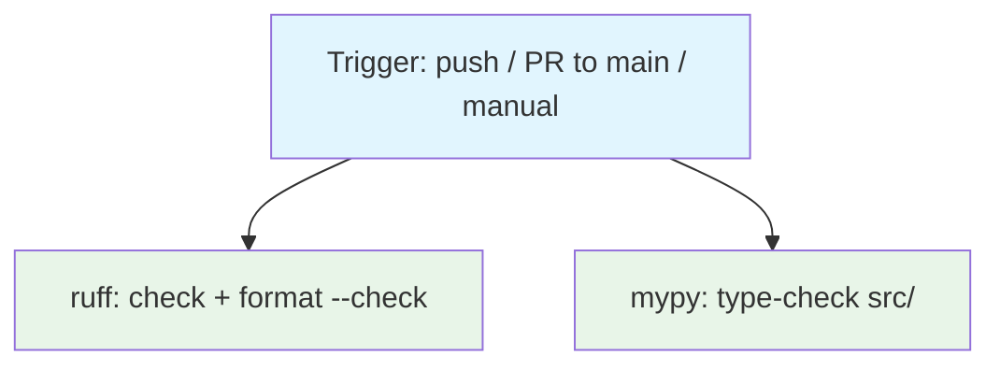

## Workflow Overview

**Purpose**: On every push and pull request, enforce a single lint + format standard for all
first-party Python (`src/`, `tests/`, `scripts/`) via Ruff, and enforce a clean static
type-check of the package source with mypy. Complements `spec/spec-process-cicd-ci.md`,
which owns install/test/coverage; this workflow owns style and typing only. Both jobs are
blocking (issue #13 drove the mypy baseline to zero).

**Trigger Events**: Push to `main`; pull request targeting `main`; manual dispatch.

**Target Environments**: None (library/plugin package). CI-only.

> **Status**: Implemented at `.github/workflows/quality.yml`. This document is the design contract
> that file must satisfy; changes to either should keep the other in sync, per Change Management below.

## Execution Flow Diagram



## Jobs & Dependencies

| Job Name | Purpose | Blocking? | Dependencies | Execution Context |
|----------|---------|-----------|--------------|-------------------|
| `ruff` | `ruff check` (lint) + `ruff format --check` (format) over the repo. Its job name is a stable required-check string for branch protection on `main`. | Yes | None | Linux runner, Python 3.12 |
| `mypy` | Run mypy over `src/` using the `[tool.mypy]` config in `pyproject.toml`. Fails the workflow on any error. Its job name is a stable required-check string for branch protection on `main`. | Yes | None | Linux runner, Python 3.12 |

## Requirements Matrix

### Functional Requirements

| ID | Requirement | Priority | Acceptance Criteria |
|----|-------------|----------|---------------------|
| REQ-001 | Lint all first-party Python with Ruff. | High | `ruff check .` exits 0; any violation fails the `ruff` job. |
| REQ-002 | Enforce a single auto-format. | High | `ruff format --check .` reports no file would be reformatted. |
| REQ-003 | Lint/format config is version-controlled and single-source. | High | `[tool.ruff]` lives in `pyproject.toml`; no competing `ruff.toml`/`setup.cfg` lint config exists. |
| REQ-004 | Tool versions match between CI and a local `pip install -e ".[dev]"`. | Medium | `ruff` and `mypy` are pinned in `setup.py`'s `dev` extra; the workflow installs only that extra, no ad-hoc tool install. |
| REQ-005 | Type-check the package source with mypy. | High | `mypy` runs against `files = ["src"]` with the `[tool.mypy]` config; a clean tree exits 0. |
| REQ-006 | A new type error blocks merge. | High | The `mypy` job has no `continue-on-error`; a non-zero mypy exit fails the workflow and the required check. The baseline is zero (issue #13). |
| REQ-007 | Each blocking check has one stable name for branch protection. | High | The blocking jobs are named exactly `ruff` and `mypy`; renaming either is a breaking change requiring a branch-protection update (see `spec/spec-process-cicd-ci.md` "Branch protection on `main`"). |

### Security Requirements

| ID | Requirement | Implementation Constraint |
|----|-------------|---------------------------|
| SEC-001 | No more repo access than reading source. | `permissions: contents: read`; no write/packages/deployments scope. |
| SEC-002 | No secrets. | The workflow references no repository or organization secret. |

### Performance Requirements

| ID | Metric | Target | Measurement Method |
|----|-------|--------|---------------------|
| PERF-001 | Wall-clock for the `ruff` job | Under 3 minutes | Checkout to job completion, excluding queue wait. |
| PERF-002 | Superseded runs on the same ref are cancelled | Redundant runs cancelled | `concurrency` group with `cancel-in-progress: true`. |
| PERF-003 | Dependency install reuses cached wheels when `setup.py` is unchanged | Cache hit reported | `actions/setup-python` pip cache keyed on `setup.py`. |

## Input/Output Contracts

### Inputs

```yaml
branches: [main]     # push trigger scope
# Pull requests targeting `main` also trigger, regardless of source branch.
# Environment Variables: none required.
# Secrets: none required.
```

### Outputs

```yaml
ruff_result: status   # pass/fail of lint + format-check; consumed by branch protection
mypy_result: status   # advisory; surfaced in logs, not consumed as a gate
```

## Execution Constraints

- **Timeout**: Each job bounded to 10 minutes.
- **Concurrency**: One in-flight run per ref (`quality-${{ github.workflow }}-${{ github.ref }}`).
- **Runner**: Standard hosted Linux runner. Single Python version (3.12) — lint and format results are
  not Python-version-sensitive at the project's `target-version` (`py310`), so no matrix.
- **Network**: Outbound to the Python package index only, for dependency installation.
- **Permissions**: Read-only `contents` (SEC-001).
- **Checkout depth**: Both `actions/checkout` steps use `fetch-depth: 0` (full history + tags), so
  `setuptools-scm` (`pyproject.toml` `[tool.setuptools_scm]`) can derive the package version during
  `pip install -e ".[dev]"`; a shallow clone would resolve every install to the `0.0.0` fallback.

## Tooling Configuration (authoritative pointers)

The exact configuration lives in `pyproject.toml`; this section records the decisions and their rationale.

### Ruff

| Setting | Value | Rationale |
|---------|-------|-----------|
| `line-length` | `100` | A deliberate loosening from the 88 default; the pre-existing code sat well above 88 and 100 keeps the one-off reformat from rewrapping nearly every signature. |
| `target-version` | `py310` | Matches `setup.py`'s `python_requires` floor (driven by `acryl-datahub>=1.7.0`). |
| `lint.select` | `E`, `F`, `I`, `UP`, `B`, `C4`, `SIM`, `RUF` | pycodestyle/pyflakes errors, import sorting, pyupgrade, bugbear, comprehensions, simplify, Ruff-native. Deliberately excludes `ANN` (annotation completeness — that is mypy's job, advisory) and `PL` (too opinionated for a solo maintainer). |
| `lint.per-file-ignores` | `__init__.py` → `F401`; `tests/**` → `E501` | Re-export modules use unused imports on purpose; test fixtures embed full DataHub URNs and JSON blobs as string literals that are not meaningfully breakable. The formatter still enforces 100 cols on everything it can reflow. |
| `lint.isort.known-first-party` | `["datahub_yaml_source"]` | Correct first/third-party split in a `src/` layout. |

Two `# noqa: E501` are carried in `src/datahub_yaml_source/models.py`: one on an aligned ASCII
capability matrix in a comment block (reflowing destroys the alignment) and one on a single-line class
docstring whose text is consumed verbatim by `scripts/generate_json_schema.py` (splitting it would
inject `\n` into the emitted JSON Schema).

**Generator coupling**: `scripts/generate_markdown_docs.py` renders the type column of
`docs/sources/yaml/reference.md` from the Pydantic field annotations in `models.py`. Ruff's `UP`
rules rewrote `Optional[X]`/`List[X]` to `X | None`/`list[X]`; `_render_type` was updated to treat
`types.UnionType` identically to `typing.Union` so the generated docs are byte-identical before and
after the reformat. Any future change to the `UP` rule set must be followed by regenerating the
schema + docs (per `AGENTS.md`) and confirming no drift.

### mypy

| Setting | Value | Rationale |
|---------|-------|-----------|
| `files` | `["src"]` | Package source only. `tests/` and `scripts/` are out of scope until the `src/` signal is clean. |
| `python_version` | `"3.10"` | Assume the semantics of the supported floor. |
| `check_untyped_defs` | `true` | Type-check bodies of unannotated functions — most of the value on a codebase with sparse annotations. |
| `warn_unused_ignores`, `warn_redundant_casts` | `true` | Low-noise staleness detectors. |
| overrides: `datahub.*`, `deepdiff.*` | `ignore_missing_imports = true` | `acryl-datahub` ships partial/absent type information; without this the log is dominated by import errors rather than findings about our code. |
| `strict` | *not set* | A strict baseline would be noise on a codebase with sparse annotations. Tightening toward strict, once the SDK's own types improve, is a possible future step. |

### mypy baseline: zero (issue #13)

At v1.0–1.1 of this spec `mypy` reported **31 errors across 11 files** (all pre-existing; it was the
first time mypy had run on the repo). Issue #13 drove that to **zero** and flipped the job to
blocking. The 31 broke down as: `list[str]` passed where the SDK types `list[str | SomeUrn]` (fixed
by widening our helper return annotations); `str | None` reaching a `list[str]` / `str` param (fixed
with explicit guards / `assert`s documenting a validator invariant); `*Doc` passed where a `*Ref`
was typed (fixed with structural `Protocol`s in `urns.py`); `AssertionInfoClass(**payload)` (an
intermediate `dict[str, Any]`); a stale 5-tuple `NaturalKey` alias (aligned to the real 3-tuple); a
duplicate `DisplayPropertiesDoc` class (deleted); `types-PyYAML` added to the `dev` extra; and one
genuine bug — a CUSTOM assertion passed a `SchemaFieldSpec` where `field=` wants a schemaField URN
string. No `mypy` baseline/ignore file, and **no `# type: ignore` comments** — every error was
resolved by a real annotation, guard, `cast`, or fix. `warn_unused_ignores` stays on so any future
suppression can't silently rot.

## Error Handling Strategy

| Error Type | Response | Recovery Action |
|------------|----------|------------------|
| Lint violation | Fail the `ruff` job | Run `ruff check --fix .` locally; hand-fix what `--fix` won't. |
| Formatting difference | Fail the `ruff` job | Run `ruff format .` locally and commit. |
| mypy error(s) | Fail the `mypy` job | Fix the annotation/guard, or (last resort, with a justifying comment) `# type: ignore[<code>]`. |
| Dependency install failure | Fail the affected job | Investigate resolution against `setup.py`. |

## Quality Gates

| Gate | Criteria | Bypass Conditions |
|------|----------|---------------------|
| Lint | `ruff check .` clean | None; rule-set changes require updating this spec. |
| Format | `ruff format --check .` clean | None. |
| Types | `mypy` exits 0 over `src/` | None; the baseline is zero. New errors must be fixed, not suppressed without cause. |

## Integration Points

### Dependent Workflows

| Workflow | Relationship | Trigger Mechanism |
|----------|---------------|---------------------|
| Branch protection on `main` | Consumes both `ruff` and `mypy` as required status checks | GitHub branch protection API (see `spec/spec-process-cicd-ci.md` "Branch protection on `main`") |
| `spec/spec-process-cicd-ci.md` (CI) | Sibling; disjoint responsibility (install/test/coverage). Both gate `main`. | Same trigger events |

## Validation Criteria

- **VLD-001**: On a branch with a deliberate lint violation, the `ruff` job fails.
- **VLD-002**: On a branch with an unformatted file, the `ruff` job fails with a diff in the log.
- **VLD-003**: On a branch that adds a new mypy error, the `mypy` job fails and the workflow
  concludes unsuccessfully.
- **VLD-004**: No job in this workflow references a secret.
- **VLD-005**: `pip install -e ".[dev]"` on a clean checkout provides `ruff` and `mypy` at the
  versions the workflow runs.

## Change Management

### Update Process

1. **Specification Update**: Modify this document first.
2. **Review & Approval**: Standard pull-request review.
3. **Implementation**: Apply changes to `.github/workflows/quality.yml` and/or `pyproject.toml` /
   `setup.py`.
4. **Testing**: Confirm the Validation Criteria on a trial PR.
5. **Deployment**: Merge once the trial run conforms.

Renaming the `ruff` or `mypy` job additionally requires updating the branch protection configuration
for `main` (its required status checks match job names verbatim).

### Version History

| Version | Date | Changes | Author |
|---------|------|---------|--------|
| 1.0 | 2026-09-05 | Initial specification. Ruff (blocking: `check` + `format --check`) and mypy (advisory, `continue-on-error`) added as `.github/workflows/quality.yml`; `[tool.ruff]` / `[tool.mypy]` introduced in a new `pyproject.toml`; `ruff`/`mypy` pinned in `setup.py`'s `dev` extra. One-off `ruff format` + safe `ruff check --fix` applied across `src/`, `tests/`, `scripts/`. Recorded mypy baseline: 31 errors / 11 files. | David Ouagne |
| 1.1 | 2026-09-05 | Added `fetch-depth: 0` to both `actions/checkout` steps: `pyproject.toml` gained a `[build-system]` + `[tool.setuptools_scm]` (issue #3), so the editable install now needs full history + tags to resolve a real version. | David Ouagne |
| 1.2 | 2026-09-07 | **mypy promoted to blocking** (issue #13). Baseline driven 31 → 0 with real fixes (no `# type: ignore`, no baseline file); one genuine bug fixed on the way (CUSTOM assertion `field=`). Job renamed `mypy (advisory)` → `mypy`, `continue-on-error` removed. `types-PyYAML` added to the `dev` extra. `mypy` added to `main`'s required status checks alongside `ruff`. | David Ouagne |

## Related Specifications

- `spec/spec-process-cicd-ci.md` — CI (install, test, coverage). This workflow is its style/typing sibling; both are required checks on `main` (the `mypy` job excepted).
