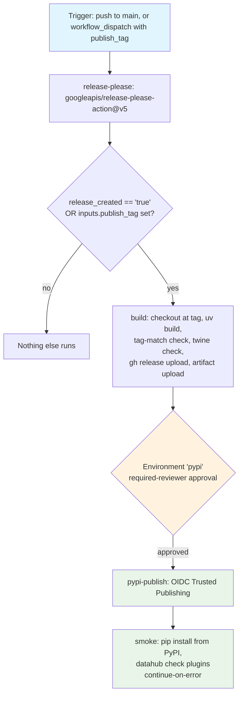

## Workflow Overview

**Purpose**: Automate the whole release lifecycle -- version computation, changelog, git tag, GitHub
Release, PyPI publish -- from Conventional Commit messages on `main`, so the maintainer never
hand-computes a semver bump or hand-writes a changelog entry again (ADR-0001, issue #58). Adapted to a
single maintainer: an Environment protection rule is the only human gate, and it sits immediately
before the one irreversible step (the PyPI upload) -- unchanged from the pre-release-please design.

**Trigger Events**: `push` to `main` (every push, not just release-PR merges -- `release-please-action`
itself decides on each run whether there's anything to do); `workflow_dispatch` with a required
`publish_tag` input, for manual recovery.

**Target Environments**: PyPI (`https://pypi.org/project/datahub-yaml-source/`), reached through a
GitHub Actions Environment named `pypi`.

> **Status**: Implemented at `.github/workflows/release.yml` + `release-please-config.json` +
> `.release-please-manifest.json`. This document is the design contract those files must satisfy;
> changes to any should keep the others in sync, per Change Management below.

## Why a mono-workflow (not a tag-triggered one)

The pre-release-please version of this workflow (`v1.x` of this spec) triggered on `push: tags:
v[0-9]+.[0-9]+.[0-9]+` -- a tag the maintainer pushed by hand. `release-please-action` creates its
release tag itself, using the workflow run's own `GITHUB_TOKEN`. GitHub Actions deliberately does not
let an action taken by `GITHUB_TOKEN` (or `GITHUB_TOKEN`-authenticated pushes/tags/PR-merges in general)
trigger *another* workflow run -- this is a loop-prevention rule, not a bug. A separate
`on: push: tags: ...` workflow would therefore never fire off a tag release-please itself created.

The fix (proven first on the sibling repo `datahub-healthdcat-ap-exporter`, issue #58): fold
`release-please`, `build`, `pypi-publish`, and `smoke` into **one workflow**, triggered by the `push:
branches: [main]` event that merging the release PR itself produces. The later jobs gate on
`release_created == 'true'`, an output of the `release-please` job in the *same* run, rather than on a
separate trigger.

## Why `release-type: simple` (not `python`)

The obvious release-please strategy for a Python package is `release-type: "python"`, which bumps a
static `version = "X.Y.Z"` field it expects to find in `pyproject.toml`. This repo's `pyproject.toml`
has no such field -- `dynamic = ["version"]` with `[tool.hatch.version] source = "vcs"`
(`hatch-vcs`) derives the version from the git tag at build time instead (issue #49's uv migration
kept this scheme). There is nothing in the repo for a `python`-type strategy to bump.

`release-type: "simple"` is release-please's generic strategy: it maintains `CHANGELOG.md` and (only if
one already exists -- `createIfMissing: false`) a `version.txt` file, and otherwise just tracks the
current version in `.release-please-manifest.json` and creates the git tag + GitHub Release. Since this
repo has no `version.txt` and never will, the version-file update step is silently a no-op every run
(confirmed empirically during dry-run verification: `‼ file version.txt did not exist`, no error) --
`hatch-vcs` picks up the new tag automatically the next time `uv build` runs against it, needing no
write from release-please at all. This is cleaner for this repo than mirroring the sibling's `python`
strategy would have been: the sibling has a static `version` field (no `hatch-vcs`), so its equivalent
workflow needs an extra step re-syncing `uv.lock` after release-please bumps `pyproject.toml` -- this
repo needs no such step, because release-please never touches `pyproject.toml` or `uv.lock` at all.

## Execution Flow Diagram



## Jobs & Dependencies

| Job Name | Purpose | Gate | Dependencies | Permissions |
|----------|---------|------|--------------|-------------|
| `release-please` | Run `googleapis/release-please-action@v5` against `release-please-config.json` / `.release-please-manifest.json`. Either opens/updates the running release PR (nothing else to do this run), or -- when a release PR was just merged -- creates the version tag, `CHANGELOG.md` entry, and GitHub Release, and reports `release_created: true` + `tag_name`. | None | None | `contents: write`, `pull-requests: write`, `issues: write` |
| `build` | Checkout at the release tag (full history for `hatch-vcs`); `uv build`; verify the built sdist filename matches the tag; `uvx twine check --strict`; attach `dist/*` to the GitHub Release release-please already created (`gh release upload`); upload `dist/` as a workflow artifact. | `release_created == 'true'` or manual `publish_tag` | `release-please` | `contents: write` |
| `pypi-publish` | Download the `dist/` artifact; upload to PyPI via `pypa/gh-action-pypi-publish` (OIDC, no secret). | GitHub Environment `pypi` -- required-reviewer approval before the job starts. | `build` | `id-token: write` only |
| `smoke` | Install the just-published version from PyPI into a fresh venv; confirm `datahub check plugins` lists `yaml`. | None (runs after publish; `continue-on-error: true`) | `release-please`, `pypi-publish` | none |

Top-level `permissions:` is empty (`{}`); each job opts in to exactly what it needs.

## Requirements Matrix

### Functional Requirements

| ID | Requirement | Priority | Acceptance Criteria |
|----|-------------|----------|---------------------|
| REQ-001 | Release PRs are computed from Conventional Commits on `main`, not hand-written. | High | `release-please-action` opens/updates a PR titled `chore(main): release X.Y.Z` whenever unreleased `feat`/`fix`/breaking-change commits exist since the last release; merging it is the only manual step. |
| REQ-002 | A commit history with no `feat`/`fix`/breaking-change commits since the last release computes no pending release. | High | Verified via `--dry-run` (see Validation Criteria) against this repo's actual history: 26 non-release commits since `v0.1.0` (all `docs`/`ci`/`build`/`chore`) computed `Would open 0 pull requests`. |
| REQ-003 | Merging the release PR triggers build + publish in the same workflow run, without a separate tag-triggered workflow. | High | See "Why a mono-workflow" above; `build`/`pypi-publish`/`smoke` gate on `needs.release-please.outputs.release_created == 'true'`, sourced from the `release-please` job earlier in the *same* run. |
| REQ-004 | The build must match the tag exactly. | High | `build` fails if `dist/datahub_yaml_source-${TAG#v}.tar.gz` is absent -- i.e. `hatch-vcs` produced a dev/local version from a dirty tree or an unclean commit. |
| REQ-005 | Metadata is valid for PyPI. | High | `twine check --strict dist/*` passes. |
| REQ-006 | Publish to PyPI without a stored secret. | High | `pypi-publish` uses `pypa/gh-action-pypi-publish` with `id-token: write` and no `password`/token input; PyPI side is a Trusted Publisher (issue #8), unchanged by this migration -- same repo, workflow filename (`release.yml`), and environment name (`pypi`). |
| REQ-007 | A human approves before the irreversible step. | High | `pypi-publish` targets the `pypi` Environment, which has a required-reviewer protection rule; the job is queued until the maintainer approves. |
| REQ-008 | Build once, publish/attach the same bytes. | Medium | `build` uploads `dist/` as an artifact; `pypi-publish` consumes it rather than rebuilding; the same `dist/*` is also attached to the GitHub Release via `gh release upload` inside `build`. |
| REQ-009 | A manual recovery path exists for a release whose automated run failed after the tag was created. | High | `workflow_dispatch` with a required `publish_tag` string input; `build`'s `if:` condition also passes when `inputs.publish_tag` is set, replaying `build -> pypi-publish -> smoke` against that already-existing tag without going through `release-please` again. |
| REQ-010 | Release notes come from Conventional Commits, not GitHub PR-label categorisation. | Medium | `release-please-action`'s default changelog builder groups by commit type (`Features`, `Bug Fixes`, etc.) directly from Conventional Commit messages; `.github/release.yml` (the old label-based `gh release create --generate-notes` categorisation) is removed -- nothing calls `--generate-notes` any more. |
| REQ-011 | A post-publish smoke test confirms the published package is actually installable and registers its plugin. | Medium | `smoke` installs `datahub-yaml-source==<version>` from PyPI into a fresh venv (retrying on PyPI propagation delay) and asserts `datahub check plugins` lists `yaml` exactly; `continue-on-error: true` so a flaky/slow PyPI propagation never reports the release itself as failed. |

### Security Requirements

| ID | Requirement | Implementation Constraint |
|----|-------------|----------------------------|
| SEC-001 | No long-lived publish credential. | OIDC Trusted Publishing only; the repository holds no PyPI API token as a secret. Unchanged from `v1.x`. |
| SEC-002 | Least privilege per job. | Top-level `permissions: {}`. `id-token: write` only on `pypi-publish`; `contents: write` on `release-please` (tag/release/PR creation) and `build` (`gh release upload`); `smoke` gets none. |
| SEC-003 | Human gate on the irreversible action. | The `pypi` Environment's required-reviewer rule blocks `pypi-publish` until the maintainer approves (REQ-007), unchanged. |
| SEC-004 | Pinned third-party actions. | `googleapis/release-please-action@v5`, `pypa/gh-action-pypi-publish@release/v1` (the PyPA-maintained moving major), `actions/*` at their major tags -- consistent with `ci.yml` / `quality.yml`. The `github-actions` Dependabot ecosystem (issue #6) tracks bumps. |
| SEC-005 | The Environment's deployment policy matches the new trigger shape. | The `pypi` Environment's deployment-branch policy was changed from a tag pattern (`v*`, type tag) to a branch (`main`), because this workflow's trigger is now `push: branches: [main]` -- `github.ref` for the run is `refs/heads/main`, never a tag ref, even though `build`/`smoke` check out a tag internally. Applied via the same mechanism as the original policy (issue #8): `gh api --method PUT/DELETE .../environments/pypi/deployment-branch-policies/...`. Without this change `pypi-publish` would be rejected by the Environment's own policy on every run. |

### Performance Requirements

| ID | Metric | Target | Measurement Method |
|----|-------|--------|---------------------|
| PERF-001 | `build` wall-clock | Under 6 minutes | Checkout to artifact upload, excluding queue wait. |
| PERF-002 | A release run is never cancelled mid-flight | No cancellation | `concurrency` group `release` (repo-wide, not per-ref -- there is only ever one release pipeline at a time now that the trigger is `main`, not a per-tag ref) with `cancel-in-progress: false`. |

## Input/Output Contracts

### Inputs

```yaml
# Trigger
branches: [main]              # push trigger
workflow_dispatch:
  publish_tag: string          # required for manual recovery runs

# Environment Variables: none required.
# Secrets: none required (OIDC).
```

### Outputs

```yaml
release_pr: pull_request        # release-please's running "chore(main): release X.Y.Z" PR
changelog: file                 # CHANGELOG.md, maintained by release-please
dist_artifact: files             # sdist + wheel, uploaded as the `dist` workflow artifact
pypi_release: package           # a new version live at pypi.org/project/datahub-yaml-source
github_release: release         # a GitHub Release for the tag, release-please-generated notes, dist/* attached
smoke_result: status            # pass/fail (advisory) of the post-publish install-and-register check
```

### Secrets & Variables

| Type | Name | Purpose | Scope |
|------|------|---------|-------|
| — | — | None -- publishing is OIDC; `release-please`/`build` use the workflow's own `GITHUB_TOKEN` (via `permissions:`/`github.token`), not a stored secret. | — |

## Execution Constraints

- **Timeout**: `release-please` 5 min, `build`/`pypi-publish` 15 min, `smoke` 10 min.
- **Concurrency**: one release pipeline in flight repo-wide (`group: release`), never cancelled.
- **Runner**: standard hosted Linux runner, single Python (3.12) -- the wheel is pure-Python and
  `py3-none-any`, so a matrix would add nothing.
- **Checkout depth**: `build` uses `fetch-depth: 0` -- `hatch-vcs` needs the tag and history to derive
  the version; a shallow clone would build `0.0.0`.
- **Environment deployment policy**: the `pypi` Environment restricts deployments to the `main` branch
  (SEC-005) -- changed from the `v*` tag pattern the pre-release-please version used, since the
  workflow's trigger ref is now always `refs/heads/main`.
- **Network**: PyPI upload endpoint + the Python package index for install (`build`, `smoke`). No other
  egress.

## Error Handling Strategy

| Error Type | Response | Recovery Action |
|------------|----------|------------------|
| No `feat`/`fix`/breaking-change commits pending | `release-please` job succeeds; no PR opened/updated, nothing downstream runs | None needed -- expected steady state (REQ-002). |
| `build`/`pypi-publish`/`smoke` never ran because the workflow run itself failed *before* `release-please` finished (e.g. runner outage) | Tag/GitHub-Release from release-please may or may not exist depending on where the run failed | Re-run the workflow (`push` re-triggers nothing on its own since the event already happened; use `workflow_dispatch` with `publish_tag` once the tag exists, or re-run the failed workflow run from the Actions UI if the tag was never created). |
| `release-please` succeeds (`release_created: true`, tag/release created) but `build`/`pypi-publish`/`smoke` fails or the run is otherwise lost | PyPI has no upload for the new tag; GitHub Release exists but has no attached `dist/*` | `workflow_dispatch` with `publish_tag: vX.Y.Z` -- REQ-009's recovery path replays `build -> pypi-publish -> smoke` against the existing tag. |
| Version/tag mismatch (REQ-004) | `build` fails at the check step | Should not happen in normal operation (release-please's own tag is always on a clean commit); if it does, investigate why `hatch-vcs` produced a dev/local version for that ref before re-running. |
| `twine check` failure | `build` fails | Fix packaging metadata in `pyproject.toml` (`[project]` / `[tool.hatch.build]`); this blocks the *next* release-please PR, since the already-created tag/release for the current one still needs REQ-009's recovery path once fixed. |
| Maintainer rejects the Environment approval | `pypi-publish` is cancelled; no upload, no `smoke` run | The tag and GitHub Release (without attached PyPI package) already exist from `release-please`; re-run `pypi-publish` (or the whole job via `workflow_dispatch`) once ready, or leave it -- PyPI is the only irreversible side effect and none occurred. |
| PyPI rejects the upload (e.g. version already exists) | `pypi-publish` fails; `smoke` does not run | Bump to a new version (next release-please PR); PyPI versions are immutable and cannot be re-uploaded. |
| `pypi-publish` succeeds but `smoke` fails (e.g. PyPI propagation delay exceeds the retry budget) | `continue-on-error: true` keeps the job (and the workflow run) green regardless | Not treated as a release failure by design (REQ-011) -- investigate the `smoke` job log; a real packaging defect surfacing only here is rare, since `build`'s `twine check` already validates metadata pre-publish. |

## Quality Gates

| Gate | Criteria | Bypass |
|------|----------|--------|
| Conventional Commit history | At least one `feat`/`fix`/breaking-change commit since the last release | None -- this is what determines whether a release PR opens at all (REQ-001/REQ-002). |
| Tag/version match | Built sdist filename equals the tag | None |
| Metadata validity | `twine check --strict` clean | None |
| Human approval | Maintainer approves the `pypi` Environment | None -- this is the gate |
| Post-publish smoke | `datahub check plugins` lists `yaml` after a fresh PyPI install | Advisory only (`continue-on-error: true`) -- never blocks or un-publishes a release |

## Integration Points

### External Systems

| System | Integration | Exchange | Notes |
|--------|-------------|----------|-------|
| PyPI | OIDC Trusted Publishing | Upload of sdist + wheel | Trusted Publisher registered against repo `davidouagne/datahub-yaml-source`, workflow `release.yml`, environment `pypi` (issue #8) -- **unchanged** by this migration: same filename, same environment name. PyPI versions are immutable. |
| GitHub Releases | `release-please-action` (creation) + `gh release upload` (`build`, attaching `dist/*`) | Release creation with release-please-generated notes; asset upload | Notes now come from Conventional Commit grouping (release-please's default changelog builder), not `.github/release.yml` label categorisation (removed, REQ-010). |
| GitHub Environments API | `gh api .../environments/pypi/deployment-branch-policies` | Deployment-branch policy change (SEC-005) | One-time reconfiguration alongside this migration: `v*` tag policy replaced with a `main` branch policy. |

### Dependent / Upstream Workflows

| Workflow | Relationship | Mechanism |
|----------|--------------|-----------|
| `spec/spec-process-cicd-ci.md` (CI) | A release PR is an ordinary PR against `main` and is gated by `CI status`/`ruff`/`mypy`/`dependency-review` like any other before it can be merged; the resulting merge commit is *also* independently re-tested by `ci.yml`'s own `push: branches: [main]` trigger. Because of this double coverage, `build` in **this** workflow deliberately does **not** re-run the test suite (unlike the pre-release-please `v1.x` design, whose `build` job ran `pytest` because a tag push had no other gate at all). | Same `push: branches: [main]` event triggers both workflows independently |
| `spec/spec-process-cicd-quality.md` (Quality) | Same as above -- release PR and post-merge commit both gated by `ruff`/`mypy` before this workflow's `build`/`publish` jobs ever run. | `pull_request` + `push` to `main` |
| `spec/spec-process-cicd-dependency-review.md` | The release PR is itself an ordinary PR, so it also passes through `dependency-review` (advisory at this spec version) like any other PR. | Same `pull_request` trigger |
| `docs/adr/0001-release-please-for-release-automation.md` | Records the decision this workflow implements. | Referenced in the workflow file's header comment |

## Edge Cases & Exceptions

| Scenario | Expected Behavior |
|----------|-------------------|
| A push to `main` that is not a release-PR merge (e.g. any other ordinary PR merge) | `release-please` job still runs (every push to `main` triggers the workflow) but just updates/opens the running release PR; `release_created` is `false`/unset, so `build`/`pypi-publish`/`smoke` do not run. This is the common case -- most pushes to `main` are not releases. |
| Two release-worthy PRs merge in quick succession before the release PR itself is merged | release-please's running PR is updated in place (its diff grows to include both), not duplicated -- there is only ever one open release PR per package. |
| The release PR is merged, but a *different* PR also merges to `main` moments later in the same push | Each push triggers its own workflow run; the run whose push corresponds to the release-PR merge is the one with `release_created: true` for that tag. Unrelated concurrent pushes don't interfere because `concurrency: group: release, cancel-in-progress: false` serialises runs rather than cancelling them. |
| Re-running `workflow_dispatch` with a `publish_tag` that was already successfully published | `build` succeeds (rebuilds identical bytes); `pypi-publish` fails at the PyPI upload step (duplicate version rejected) -- same immutability behavior as the pre-release-please design; `smoke` does not run. Harmless duplicate-run protection, not a new failure mode. |
| Pre-release version bump (e.g. `v1.2.3-rc1`) | Not configured at this spec version (`release-please-config.json` has no `prerelease` setting) -- release-please always computes a normal release. Adding a pre-release lane is future work, matching the pre-release-please design's same deferral. |
| sdist contents | Curated by `pyproject.toml`'s `[tool.hatch.build.targets.sdist]` `exclude` list (`tests`, `docs`, `spec`, `scripts`, `.github`, repo-meta files, and now also `release-please-config.json` / `.release-please-manifest.json` if they'd otherwise be swept in) -- see Change Management for the follow-up this spec version defers. |
| README relative links on PyPI | `long_description` is `README.md` verbatim; its `docs/...` / `_PLANNING.md` links are repo-relative and do not resolve on the PyPI page. Cosmetic, unchanged from `v1.x`. |

## Validation Criteria

- **VLD-001**: `npx release-please release-pr --repo-url=davidouagne/datahub-yaml-source --token=<gh
  token> --config-file=release-please-config.json --manifest-file=.release-please-manifest.json
  --dry-run --target-branch=<branch with the config committed>` runs without a `ConfigurationError` and
  reports a coherent result against this repo's real commit history. **Confirmed**: against the actual
  history at the time of this spec version (26 non-release commits since `v0.1.0`, all
  `docs`/`ci`/`build`/`chore`), it reported `Would open 0 pull requests` -- correctly finding nothing
  release-worthy. A throwaway `fix:` commit (reverted before the real PR) made the same dry-run report
  `Would open 1 pull requests`, title `chore(<branch>): release 0.1.1`, with a `### Bug Fixes` changelog
  section and `version.txt did not exist` logged as a harmless skip (see "Why `release-type: simple`").
- **VLD-002**: The first real push to `main` after this workflow merges opens (or updates) a
  `chore(main): release X.Y.Z` PR, labeled `autorelease: pending`, whenever unreleased `feat`/`fix`
  commits exist.
- **VLD-003**: Merging that release PR produces, within the same triggered workflow run: a new tag
  matching `v[0-9]+.[0-9]+.[0-9]+`, an updated `CHANGELOG.md` entry, a GitHub Release, then (after
  Environment approval) a live PyPI upload, then a passing (or advisory-failing) `smoke` job.
- **VLD-004**: `gh api repos/davidouagne/datahub-yaml-source/environments/pypi/deployment-branch-policies`
  lists a `branch` policy named `main` (not a `tag` policy) -- confirms SEC-005 was actually applied,
  not just documented.
- **VLD-005**: `workflow_dispatch` with `publish_tag` set to an existing tag re-runs `build ->
  pypi-publish -> smoke` against it, independent of `release-please`'s own output that run.
- **VLD-006**: No job references a repository or organization secret.
- **VLD-007**: After a successful run, `pip install datahub-yaml-source==<X.Y.Z>` works and `datahub
  check plugins` lists `yaml` -- now automated by the `smoke` job rather than a manual check.

## Change Management

### Update Process

1. **Specification Update**: modify this document first.
2. **Implementation**: apply to `.github/workflows/release.yml`, `release-please-config.json`, and/or
   `.release-please-manifest.json`.
3. **Verification**: `--dry-run` against the change (VLD-001), then confirm the Validation Criteria
   against the next real release PR / merge.
4. **Deployment**: merge; the next qualifying push to `main` exercises it.

**Deferred to a follow-up, not part of this version**: adding `release-please-config.json` /
`.release-please-manifest.json` to `pyproject.toml`'s sdist `exclude` list. Low priority -- these are
tiny JSON files and their presence in the sdist is harmless (unlike, say, `.github/` workflow files,
which are excluded mainly to keep the sdist lean and because they'd be meaningless outside this repo);
noted here so it isn't mistaken for an oversight later.

### Version History

| Version | Date | Changes | Author |
|---------|------|---------|--------|
| 1.0 | 2026-09-05 | Initial specification. `release.yml` (build+verify → gated `pypi-publish` via OIDC → `github-release`) and `.github/release.yml` note categorisation added. PyPI packaging metadata fleshed out in `setup.py`; `MANIFEST.in` added to curate the sdist. TestPyPI lane and pre-release tags deliberately deferred. | David Ouagne |
| 1.1 | 2026-09-14 | Migrated from `pip`/`setup.py` to `uv`/`pyproject.toml` (issue #49): `build` installs via `uv sync --frozen --group dev --extra git --extra s3`, runs tests and builds via `uv run pytest` / `uv build`, and checks metadata via `uvx twine check --strict`. Version derivation moved from `setuptools-scm` to `hatch-vcs`. No change to triggers, gates, the Environment approval, or OIDC publishing. | David Ouagne |
| 2.0 | 2026-09-15 | **Replaced the manual-tag-triggered workflow with `release-please` (ADR-0001, issue #58).** Trigger changed from `push: tags: v*` to `push: branches: [main]` + `workflow_dispatch` (mono-workflow, see "Why a mono-workflow"). New `release-please` job (`googleapis/release-please-action@v5` + `release-please-config.json` + `.release-please-manifest.json`, `release-type: simple` -- see "Why `release-type: simple`" for why not `python`). `build` no longer re-runs the test suite (superseded rationale, see Dependent/Upstream Workflows) and now attaches `dist/*` to the release-please-created GitHub Release via `gh release upload` instead of a separate `github-release` job calling `gh release create --generate-notes`; `.github/release.yml` removed as dead config (REQ-010). New `smoke` job (advisory, `continue-on-error: true`) automates what was previously only a manual validation criterion (REQ-011). `pypi` Environment's deployment-branch policy changed from tag pattern `v*` to branch `main` (SEC-005) -- required for `pypi-publish` to run at all under the new trigger, applied as part of this same change. PyPI Trusted Publisher config itself (repo, workflow filename, environment name) is unchanged. Verified via `--dry-run` against the real commit history (0 pending PRs, correctly) and against a throwaway `fix:` commit (correctly computed a 0.1.0 → 0.1.1 patch bump with a changelog entry) -- see VLD-001. | David Ouagne |

## Related Specifications

- `spec/spec-process-cicd-ci.md` -- CI (install/test/coverage). The release PR and its merge commit are
  both gated by this before `release.yml`'s `build`/`publish` jobs matter.
- `spec/spec-process-cicd-quality.md` -- Ruff/mypy, same PR/push gating as CI.
- `spec/spec-process-cicd-dependency-review.md` -- gates the release PR like any other PR.
- `docs/adr/0001-release-please-for-release-automation.md` -- the decision record this workflow
  implements.
