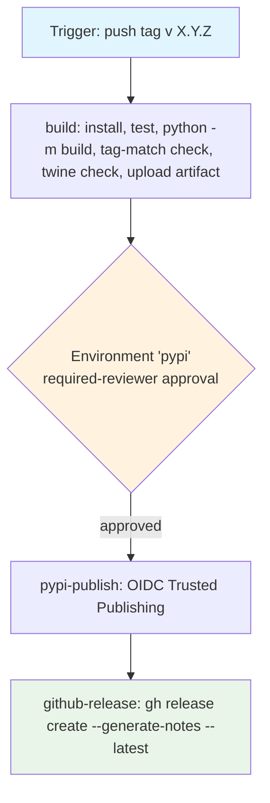

## Workflow Overview

**Purpose**: On a version tag, build the `datahub-yaml-source` sdist + wheel, verify them against the
tagged commit, publish to PyPI via OIDC Trusted Publishing (no API token), and cut a GitHub Release
with auto-generated notes. Adapted to a single maintainer: an Environment protection rule is the only
human gate, and it sits immediately before the one irreversible step (the PyPI upload).

**Trigger Events**: Push of a tag matching `v[0-9]+.[0-9]+.[0-9]+` (three numeric components, `v`
prefix). Nothing else — no `workflow_dispatch` (it would let a publish happen off an untagged commit),
no branch push.

**Target Environments**: PyPI (`https://pypi.org/project/datahub-yaml-source/`), reached through a
GitHub Actions Environment named `pypi`.

> **Status**: Implemented at `.github/workflows/release.yml` (+ `.github/release.yml` for note
> categorisation). This document is the design contract those files must satisfy; changes to either
> should keep the other in sync, per Change Management below.

## Execution Flow Diagram



## Jobs & Dependencies

| Job Name | Purpose | Gate | Dependencies | Permissions |
|----------|---------|------|--------------|-------------|
| `build` | Checkout with full history/tags; install `.[dev]` + `build`/`twine`; run the unit + integration suite against the tagged commit; `python -m build`; assert the built sdist filename matches the tag; `twine check --strict`; upload `dist/` as a workflow artifact. | None | None | `contents: read` |
| `pypi-publish` | Download the `dist/` artifact and upload it to PyPI with `pypa/gh-action-pypi-publish` (OIDC, no secret). | GitHub Environment `pypi` — required-reviewer approval before the job starts. | `build` | `id-token: write` only |
| `github-release` | Download the same `dist/` artifact; `gh release create <tag> --generate-notes --latest` with the artifacts attached. | None (but downstream of the gated publish, so it only runs after a successful upload). | `pypi-publish` | `contents: write` only |

Top-level `permissions:` is empty (`{}`); each job opts in to exactly what it needs.

## Requirements Matrix

### Functional Requirements

| ID | Requirement | Priority | Acceptance Criteria |
|----|-------------|----------|---------------------|
| REQ-001 | Release only from a version tag. | High | Workflow triggers solely on `push` of a tag matching `v[0-9]+.[0-9]+.[0-9]+`; no `workflow_dispatch`, no branch trigger. |
| REQ-002 | Re-verify the tagged commit. | High | `build` runs `pytest tests/unit tests/integration` before any artifact is produced; a failure stops the release. Rationale: `ci.yml` never runs on tags, so this SHA is otherwise untested. |
| REQ-003 | Build both distribution formats. | High | `python -m build` produces `datahub_yaml_source-<X.Y.Z>.tar.gz` and `...-py3-none-any.whl`. |
| REQ-004 | The build must match the tag exactly. | High | `build` fails if `dist/datahub_yaml_source-${GITHUB_REF_NAME#v}.tar.gz` is absent — i.e. setuptools-scm produced a dev/local version from a dirty tree or a tag off a non-clean commit. |
| REQ-005 | Metadata is valid for PyPI. | High | `twine check --strict dist/*` passes (renderable long description, valid metadata). |
| REQ-006 | Publish to PyPI without a stored secret. | High | `pypi-publish` uses `pypa/gh-action-pypi-publish` with `id-token: write` and no `password`/token input; PyPI side is a Trusted Publisher (see `spec` cross-ref and issue #8). |
| REQ-007 | A human approves before the irreversible step. | High | `pypi-publish` targets the `pypi` Environment, which has a required-reviewer protection rule; the job is queued until the maintainer approves. |
| REQ-008 | Build once, publish the same bytes twice. | Medium | `build` uploads `dist/` as an artifact; `pypi-publish` and `github-release` both consume that artifact rather than rebuilding. |
| REQ-009 | GitHub Release only after a successful PyPI upload. | Medium | `github-release` `needs: pypi-publish`; a failed or rejected publish leaves no GitHub Release behind. |
| REQ-010 | Release notes are categorised. | Low | `gh release create --generate-notes` reads `.github/release.yml`: Features (`enhancement`), Fixes (`bug`), Documentation (`documentation`), Dependencies (`dependencies`), Other (`*`); `wayfinder:*` / `question` / `duplicate` / `invalid` / `wontfix` excluded. |
| REQ-011 | The release is marked latest. | Low | `gh release create ... --latest`, artifacts (`dist/*`) attached. |

### Security Requirements

| ID | Requirement | Implementation Constraint |
|----|-------------|---------------------------|
| SEC-001 | No long-lived publish credential. | OIDC Trusted Publishing only; the repository holds no PyPI API token as a secret. |
| SEC-002 | Least privilege per job. | Top-level `permissions: {}`. `id-token: write` is granted only to `pypi-publish`; `contents: write` only to `github-release`; `build` gets `contents: read`. |
| SEC-003 | Human gate on the irreversible action. | The `pypi` Environment's required-reviewer rule blocks `pypi-publish` until the maintainer approves (REQ-007). |
| SEC-004 | Pinned third-party actions. | `pypa/gh-action-pypi-publish@release/v1` (the PyPA-maintained moving major); `actions/*` at their major tags, consistent with `ci.yml` / `quality.yml`. The `github-actions` Dependabot ecosystem (issue #6) tracks bumps. |

### Performance Requirements

| ID | Metric | Target | Measurement Method |
|----|-------|--------|---------------------|
| PERF-001 | `build` wall-clock | Under 6 minutes | Checkout to artifact upload, excluding queue wait. |
| PERF-002 | A release run is never cancelled mid-flight | No cancellation | `concurrency` group `release-${{ github.ref }}` with `cancel-in-progress: false`. |

## Input/Output Contracts

### Inputs

```yaml
tags: ["v[0-9]+.[0-9]+.[0-9]+"]   # the only trigger
# Environment Variables: none required.
# Secrets: none required (OIDC).
```

### Outputs

```yaml
dist_artifact: files          # sdist + wheel, uploaded as the `dist` workflow artifact
pypi_release: package         # a new version live at pypi.org/project/datahub-yaml-source
github_release: release       # a GitHub Release for the tag, notes auto-generated, dist/* attached
```

### Secrets & Variables

| Type | Name | Purpose | Scope |
|------|------|---------|-------|
| — | — | None — publishing is OIDC | — |

## Execution Constraints

- **Timeout**: `build` / `pypi-publish` 15 min, `github-release` 10 min.
- **Concurrency**: one in-flight run per tag ref; never cancelled (`cancel-in-progress: false`).
- **Runner**: standard hosted Linux runner, single Python (3.12) — the wheel is pure-Python and
  `py3-none-any`, so a matrix would add nothing.
- **Checkout depth**: `fetch-depth: 0` on every checkout — setuptools-scm needs the tag and history to
  derive the version; a shallow clone would build `0.0.0`.
- **Network**: PyPI upload endpoint + the Python package index for install. No other egress.

## Error Handling Strategy

| Error Type | Response | Recovery Action |
|------------|----------|------------------|
| Test failure on the tagged commit | `build` fails; nothing is built or published | Fix on `main`, delete and re-push the tag from a green commit |
| Version/tag mismatch (REQ-004) | `build` fails at the check step | Ensure the tag is on a clean commit with no uncommitted changes; re-tag |
| `twine check` failure | `build` fails | Fix packaging metadata (`setup.py` / `MANIFEST.in`), re-tag |
| Maintainer rejects the Environment approval | `pypi-publish` is cancelled; no upload, no GitHub Release | None needed — the tag can be re-run or deleted |
| PyPI rejects the upload (e.g. version already exists) | `pypi-publish` fails; no GitHub Release | Bump to a new version; PyPI versions are immutable and cannot be re-uploaded |
| `pypi-publish` succeeds but `github-release` fails | PyPI has the release; GitHub does not | Re-run the `github-release` job, or `gh release create` the tag by hand — the artifact is still on the run |

## Quality Gates

| Gate | Criteria | Bypass |
|------|----------|--------|
| Tagged-commit tests | `pytest tests/unit tests/integration` green | None |
| Tag/version match | Built sdist filename equals the tag | None |
| Metadata validity | `twine check --strict` clean | None |
| Human approval | Maintainer approves the `pypi` Environment | None — this is the gate |

## Integration Points

### External Systems

| System | Integration | Exchange | Notes |
|--------|-------------|----------|-------|
| PyPI | OIDC Trusted Publishing | Upload of sdist + wheel | Trusted Publisher registered against repo `davidouagne/datahub-yaml-source`, workflow `release.yml`, environment `pypi` (issue #8). PyPI versions are immutable. |
| GitHub Releases | `gh` CLI (`github.token`) | Release creation + asset upload | Notes generated from merged-PR labels per `.github/release.yml`. |

### Dependent / Upstream Workflows

| Workflow | Relationship | Mechanism |
|----------|--------------|-----------|
| `spec/spec-process-cicd-ci.md` (CI) | Upstream in intent: a tag should only ever be cut from a `main` commit whose `CI status` is green. Not enforced by a cross-workflow dependency (GitHub has none for tag triggers); `release.yml` instead re-runs the suite itself (REQ-002). | Human discipline + REQ-002 |
| `spec/spec-process-cicd-quality.md` (Quality) | None at release time; Ruff/mypy are PR-time gates. | — |
| Dependabot (`github-actions` ecosystem, issue #6) | Keeps `pypa/gh-action-pypi-publish` and `actions/*` current. | PRs |

## Edge Cases & Exceptions

| Scenario | Expected Behavior |
|----------|-------------------|
| Tag pushed to a commit not on `main` | Workflow still runs (GitHub can't scope a tag trigger to a branch). REQ-002's test run is the safety net; the maintainer approval is the final check. |
| Pre-release tag (`v1.2.3rc1`, `v1.2.3.dev1`) | Does **not** match the trigger pattern — ignored. Adding a pre-release lane is future work, not in this version. |
| Re-pushing an already-released tag | `build`/tests may pass, but PyPI rejects the duplicate version at `pypi-publish`; no GitHub Release. Cut a new version instead. |
| sdist contents | Curated by `MANIFEST.in` (`prune tests docs spec scripts .github`, exclude repo-meta files); without it, setuptools-scm's file finder would ship the whole tree. |
| README relative links on PyPI | `long_description` is `README.md` verbatim; its `docs/...` / `_PLANNING.md` links are repo-relative and do not resolve on the PyPI page. Cosmetic, accepted for now. |

## Validation Criteria

- **VLD-001**: Pushing a non-matching tag (`v1.2`, `1.2.3`, `v1.2.3-rc1`) does not start the workflow.
- **VLD-002**: With a clean checkout at tag `v0.1.0`, `build` produces `datahub_yaml_source-0.1.0.tar.gz`
  and `...-0.1.0-py3-none-any.whl` and the tag-match check passes.
- **VLD-003**: `pypi-publish` stays queued until a reviewer approves the `pypi` Environment.
- **VLD-004**: No job references a repository or organization secret.
- **VLD-005**: After a successful run, `pip install datahub-yaml-source==<X.Y.Z>` works and
  `datahub check plugins` lists `yaml`.
- **VLD-006**: A GitHub Release exists for the tag, marked latest, with `dist/*` attached and notes
  grouped per `.github/release.yml`.

## Change Management

### Update Process

1. **Specification Update**: modify this document first.
2. **Review & Approval**: standard pull-request review.
3. **Implementation**: apply to `.github/workflows/release.yml` and/or `.github/release.yml`.
4. **Testing**: dry-run against a throwaway pre-release tag on a fork, or a `TestPyPI` lane if one is
   later added; otherwise the first real tag is the validation.
5. **Deployment**: merge; the next `v*` tag exercises it.

### Version History

| Version | Date | Changes | Author |
|---------|------|---------|--------|
| 1.0 | 2026-09-05 | Initial specification. `release.yml` (build+verify → gated `pypi-publish` via OIDC → `github-release`) and `.github/release.yml` note categorisation added. PyPI packaging metadata fleshed out in `setup.py`; `MANIFEST.in` added to curate the sdist. TestPyPI lane and pre-release tags deliberately deferred. | David Ouagne |

## Related Specifications

- `spec/spec-process-cicd-ci.md` — CI (install/test/coverage). The commit a tag points at should be
  green there; `release.yml` re-runs the suite because a tag trigger can't depend on it.
- `spec/spec-process-cicd-quality.md` — Ruff/mypy, PR-time only, no role at release.
